- **Authors**: Ali Taha, Jiexiang Liu, and Hengjie Wang
- **Date**: August 28, 2025

This series of blog posts will showcase how one can:

1. Write a high-performance GPU kernel on Blackwell that offers performance
   competitive to that of NVIDIA's cuBLAS implementation.
2. Shows how one can leverage Mojo's special features to make the kernel as
   simple as possible.

It is our hope that this series of blogs serves as *the reference worklog* for
NVIDIA’s Blackwell GPU. While there is prior work on optimizing NVIDIA's
[Ampere](https://siboehm.com/articles/22/CUDA-MMM) and
[Hopper](https://cudaforfun.substack.com/p/outperforming-cublas-on-h100-a-worklog)
generation of GPUs, none currently exist to provide a blueprint for optimizing
NVIDIA's Blackwell GPUs.

In Part 1 (this blog post) we cover what a Matrix Multiplication (matmul) is,
its importance for LLMs, and why we need to optimize it. Then we explain what a
GPU is, GPU history since Ampere, and finally how to write a simple (not super
performant) implementation of matmul on a GPU in 4 lines of Mojo.

In Part 2, we’ll explain the hardware instructions introduced in Blackwell
GPUs, and continue improve on our kernels' performance to make it leverage the
new hardware instructions. As we continue through the blog series, we will
incrementally leverage new Blackwell features to improve our matmul
implementation until the end of the series where we achieve performance that
surpasses that of NVIDIA's cuBLAS library.

## Performance at a glance

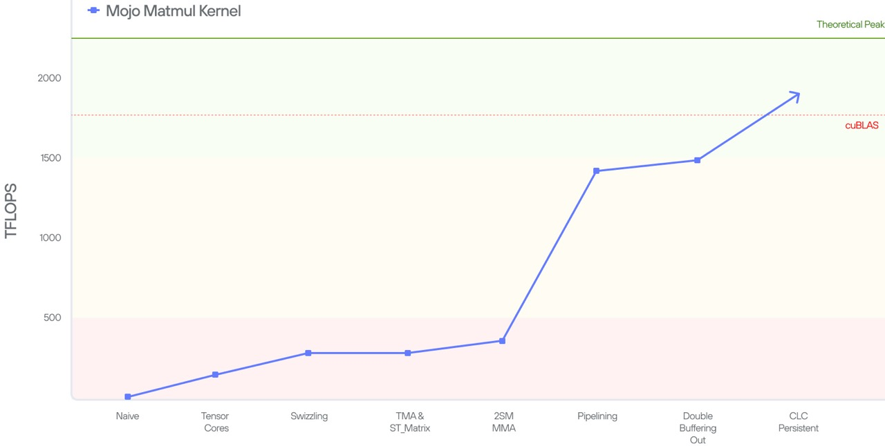
///caption
Performance at a glance
///

## What is matmul?

Given two dense matrices $A$ and $B$ of dimensions $M\times K$ and $K\times N$
respectively, we want to compute the matrix multiplication  $C = A . B$ which
is defined by:

$$
C_{i,j} = \sum_{k \in [0 \cdots K)} A_{i,k} B_{k,j}
$$

In pseudo-code this is written as:

```pseudocode
for row in range(M):
  for col in range(N):
    C[row][col] = 0
    for inner in range(K):
      C[row][col] += A[row][inner]*B[inner][col]
```

Since matrix multiplication is a core part of linear algebra and presents
itself in many areas, there has been extensive research on writing efficient
algorithms. Readers who are interested in a deeper background of matmul are
encouraged to read our blog post from [2 years
ago](https://www.modular.com/blog/ais-compute-fragmentation-what-matrix-multiplication-teaches-us).

### Why does matmul matter today?

All LLMs, be it Meta's Llama, Alibaba's Qwen, Deepseek, Anthropics' Claude,
OpenAI's ChatGPT, or Google's Gemini, utilize matrix multiplications at their
core. These matmuls might be disguised under multiple names, for instance, the
multi-layer perceptron (MLP) which is sometimes called the Linear layer is an
$A.B^T$ matmul operation. The same is true for Attention, latent attention,
mixture of experts, etc.

In fact, if we look at a profile from the Llama 8B model using FP8 on 2xB200,
we observe that over 83% of the model's runtime is occupied executing some
variant of matmul (e.g. linear, attention and mlp layers).

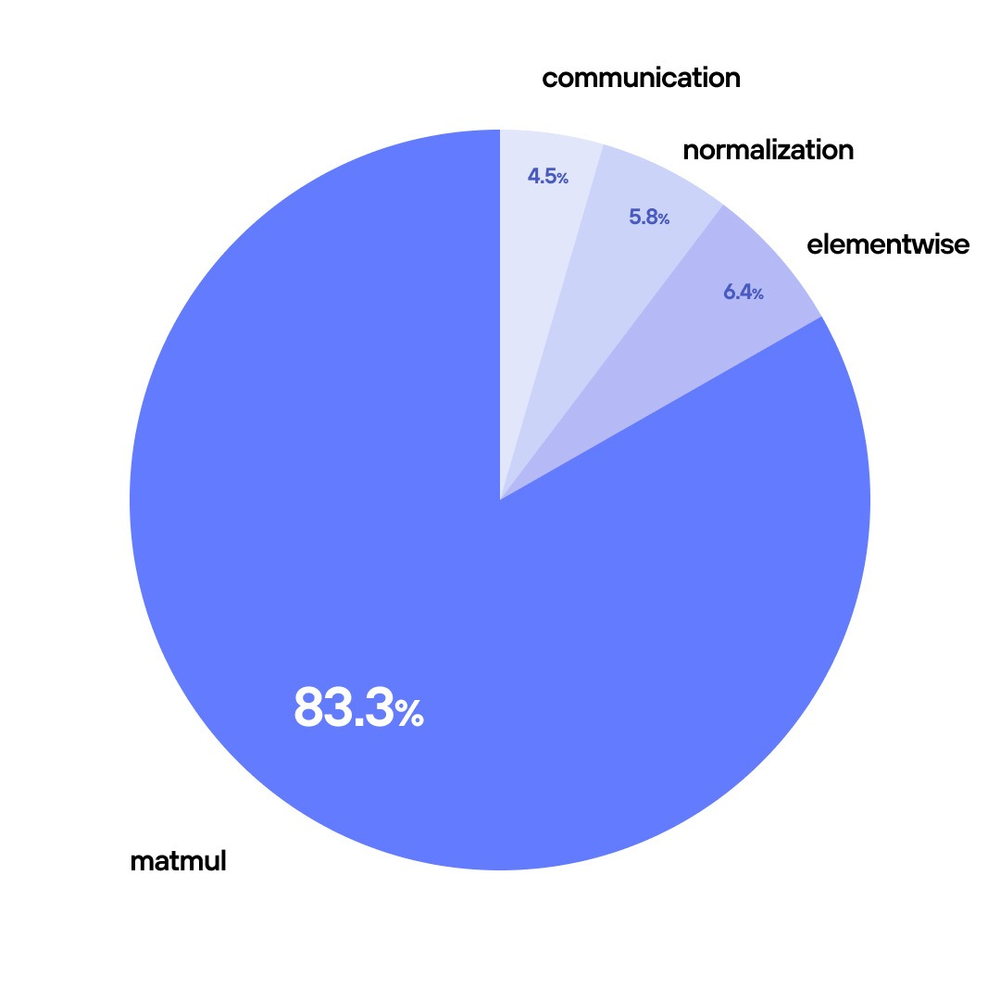
///caption
matmul makes up more than 80% of Llama 8B execution
///

As a result, even a 10% improvement in matmul performance yields around 8%
end-to-end speedup. For companies spending hundreds of millions on serving,
these optimizations translate directly to millions of dollars in savings.

## Why do we care about GPUs?

We will motivate the value of GPUs by looking at matmul. Furthermore, for
simplicity, let’s assume both A and B matrices are square, such that:

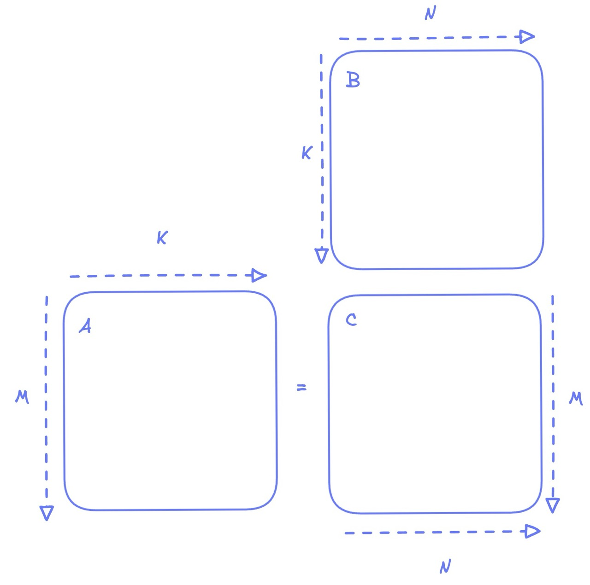
///caption
Simplfied illustration of matrix multiplication
///

If we want to do the matmul on a CPU, then here’s pseudocode code we’ll have to
write:

```mojo
for row in range(M):
 for col in range(N):
  for inner in range(K):
        result[row][col]+=A[row][inner]*B[inner][col];
```

Essentially the code calculates the inner product across the K dimension for
output element.

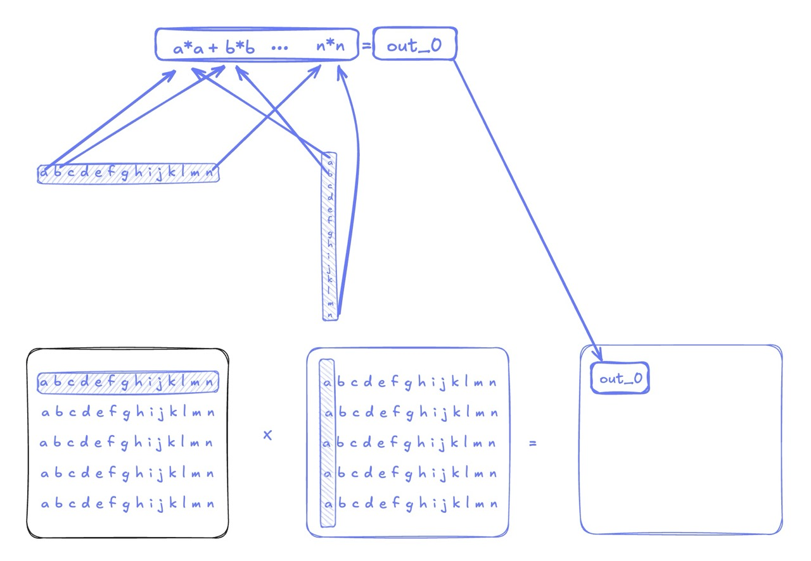
///caption
Matrix multiplication as a collection of inner products
///

CPUs are limited to on the order of a few hundred cores (with lower-end CPUs
having around 32 cores and high-end models having on the order of 128 cores).
GPUs, on the other hand, offer massive parallelism: modern GPUs handle over
100,000 threads simultaneously (B200s can handle up to 151,552 threads), making
them the ideal hardware choice for repetitive, data-parallel operations like
matrix multiplication.

To accelerate things even further, recent GPUs (since Volta) have a dedicated
fast hardware unit for matrix multiply accumulate (MMA) operations called
tensor core. While originally Tensor cores were limited to small matmuls (on
the order of 16x16x16), the 5th generation tensors cores introduced in
Blackwell can perform a large sub-matrix multiplication (up to 256x256x16).
This enables the Blackwell GPUs to increase the peak computation throughput.

### GPU from the hardware architect perspective?

To understand GPUs better, let's look at how the GPU is organized from a
hardware architecture perspective. A GPU, like other [Von
Neumann](https://en.wikipedia.org/wiki/Von_Neumann_architecture) architectures,
is composed of elements that compute (commonly known as Arithmetic Logical
Units or ALUs), and elements that load/store the data for these computations. A
GPU will contain several Streaming Multiprocessor
([SM](https://docs.modular.com/glossary/gpu/streaming-multiprocessor)), [L2
Cache and global memory](https://docs.modular.com/glossary/gpu/memory) which
are shared among these SMs, and an interconnect to the host device (CPU).

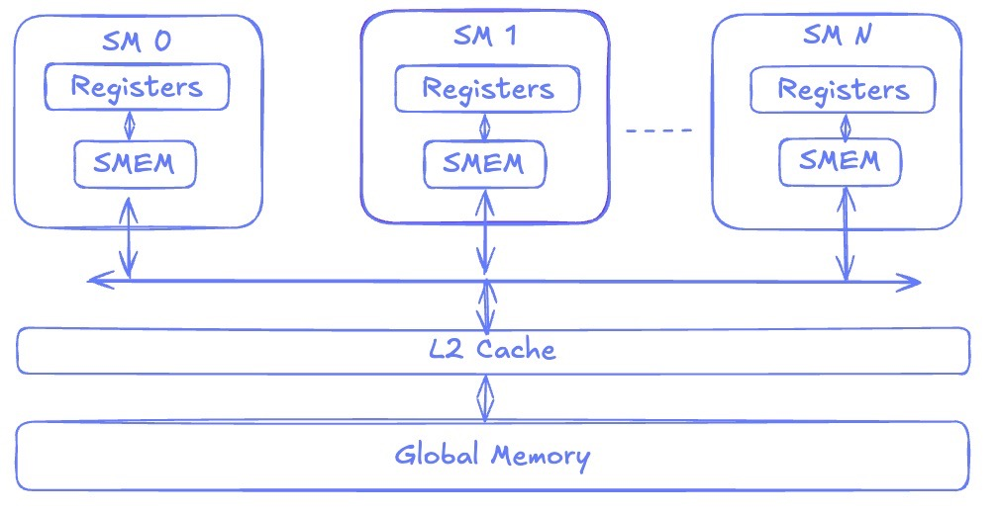
///caption
GPU architecture
///

Threads on a GPU are grouped into blocks which are called [Thread
Blocks](https://docs.modular.com/glossary/gpu/thread-block) or Cooperative
Thread Arrays (CTAs). Each of these blocks gets scheduled onto **a single**
[SM](https://docs.modular.com/glossary/gpu/streaming-multiprocessor). Each SM,
in turn, access the data via a shared L2 cache which loads data from global
memory. The threads in each SM have access to two more memory regions:

1. Registers which are local variables and are private to each thread.
2. Shared memory which is visible across threads in an SM*. Since Hopper,
   multiple CTAs can form a cluster and CTAs within the same cluster can access
   each other's shared memory.*


///caption
Cooperative Thread Array (CTA) layout
///

There are simplifying assumptions made in the above description, but the above
serves as a good mental model of GPUs.

### What are tensor cores?

While the GPU is an accelerator, within it lies hundreds of mini-accelerators,
called Tensor Cores. Tensor Cores are specialized units to perform
matrix-multiply-accumulate operations. This is different from the other ALU
units which can perform arithmetic computation.

Let's dig into the definition of a Tensor Core by an example. Say we wanted to
multiply two matrices together, where the A matrix is `MxK` in dimension and
the B matrix is  `KxN` in dimension


///caption
Multiplying an MxK matrix with a KxN matrix
///

A CUDA core processes a fused multiplication and addition operation at a time,
so we are multiplying a single element from matrix `A` by another element from
matrix `B` and accumulating the value in `C` per instruction. A Tensor Core, on
the other hand, computes an MMA operation (e.g. a 64×128 tile), in a single
instruction.

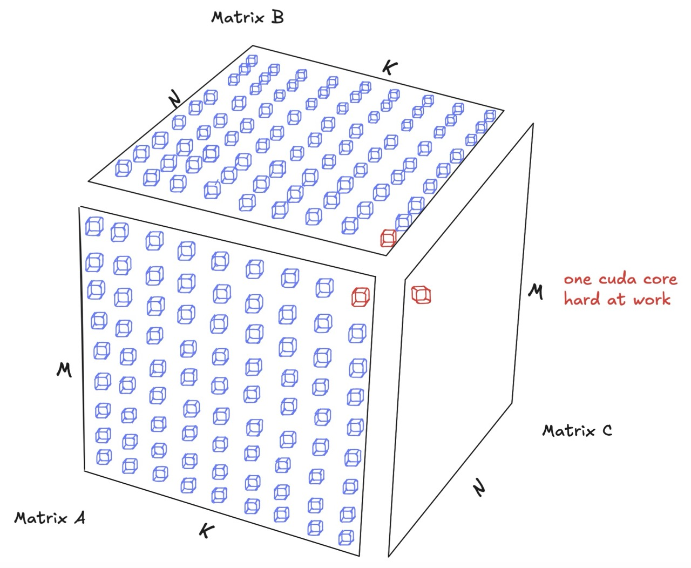
///caption
Matrix multiplication with a single CUDA core
///


///caption
Matrix multiplication with a single tensor core
///

And so it’s natural to see the performance improvement. On a large scale matrix
of dimension  MxN, we can achieve massive speedup by decomposing the matmul
into smaller matmuls (a technique called tiling which will be discussed in a
subsequent blog post) and perform the computation using fewer instructions. As
a result, we get massive speedups.

The number of Tensor Cores per SM (4 if you’re curious) is not important. This
is because when we launch the MMA instructions, the hardware takes care of the
partitioning / distribution of the MMA among the tensor cores for us.

In Hopper, the largest WGMMA (Warp Group Matrix Multiply and Accumulate) shape
was 64×256×16. WGMMA instructions required four warps (a warp group) and the
instruction stored the results in the thread registers. However, Blackwell's
5th generation tensor core (tcgen05) scales up the MMA to 256x256x16 on 2 SMs,
and introduces tensor memory, to reduce register usage (which will be covered
in subsequent posts).

### What is GPU programming?

A detailed description of GPU programming fundamentals is beyond the scope of
this blog post. There are many resources that explain the GPU programming
paradigm, and a great resource is
<https://puzzles.modular.com/introduction.html> and the GPU
[glossary](https://docs.modular.com/glossary/).

As a result of the massive parallelism afforded to by the GPU, one has to think
about GPU programming differently. For example, while, in traditional CPU
programming we process data sequentially through loops:

```mojo
# CPU approach
for i in range(data_size):
 result[i] = process(data[i])
```

With GPUs, we flip this model entirely and process data via threads. So,
instead of moving sequentially through data, we map thousands of parallel
threads directly onto the data. For our case above, the body of the function
would look like:

```mojo
# GPU approach (conceptual)
thread_id = global_idx.x
result[thread_id] = process(data[thread_id])
```

On GPUs, each thread becomes responsible for computing a single element,
eliminating the need for explicit loops. This mental shift- from “stepping
through data” to “blanketing data with compute”- is central to GPU programming.
If we think about the [Flynn
taxonomy](https://en.wikipedia.org/wiki/Flynn%27s_taxonomy), this maps into the
Single Instruction Multiple Threads (SIMT) programming model.

When launching a [kernel](https://docs.modular.com/glossary/gpu/kernel)
(calling the function), you specify the number of threads in each
[block](https://docs.modular.com/glossary/gpu/thread-block) (also called block
size), and how many blocks you want to launch (called the
[grid](https://docs.modular.com/glossary/gpu/grid) size). Each block gets
mapped to an SM by the hardware. As a result, threads within the same block can
share memory and synchronize with each other, but cannot directly communicate
across blocks- unless they are within the same cluster (discussed later). Note
that while each block of threads is executed on only one of the SM’s, but each
SM can execute multiple blocks (CTAs):

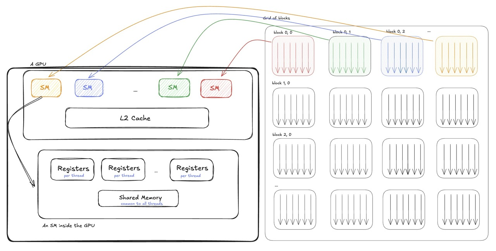

So to recap, we mentioned that we launch a grid of CTAs - each CTA contains a
contiguous array of threads- and each CTA is scheduled on one SM.

If we dig deeper into the execution model of a CTA, we note that each block is
further subdivided into a set of warps. A warp consists of 32 threads that run
the program counter in lockstep. So if we launch a block of 128 threads, we
would implicitly have launched a block of 4 warps. The two are synonymous, and
no additional programming on your part is needed.

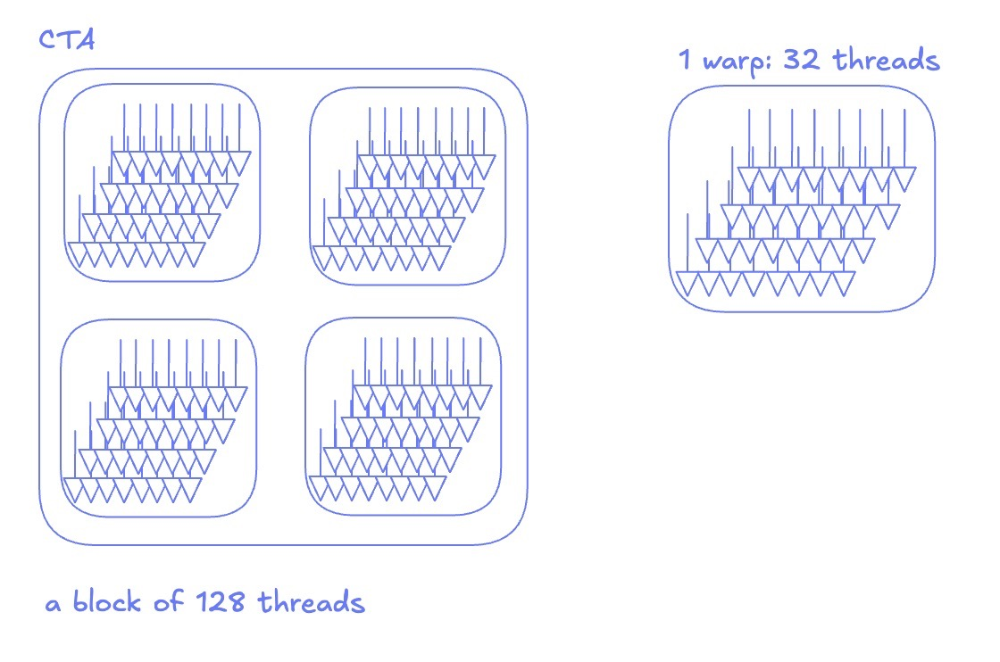
///caption
CTA division into blocks and warps
///

Each SM internally has 4 warp schedulers (physical units that issue
instructions by the granularity of a warp). Different warps can execute in
parallel on different warp schedulers and concurrently on the same warp
scheduler.

This is useful because an SM can yield to other warps if the instructions are
not ready to be executed on the current warp -- thus giving the programmer some
latency hiding. For example, if a warp requires data from memory, it has to
wait till that data is fetched. Instead of sitting idle, the warp scheduler
swaps it out for another warp that has its data ready. That way, the GPU is
never idle.

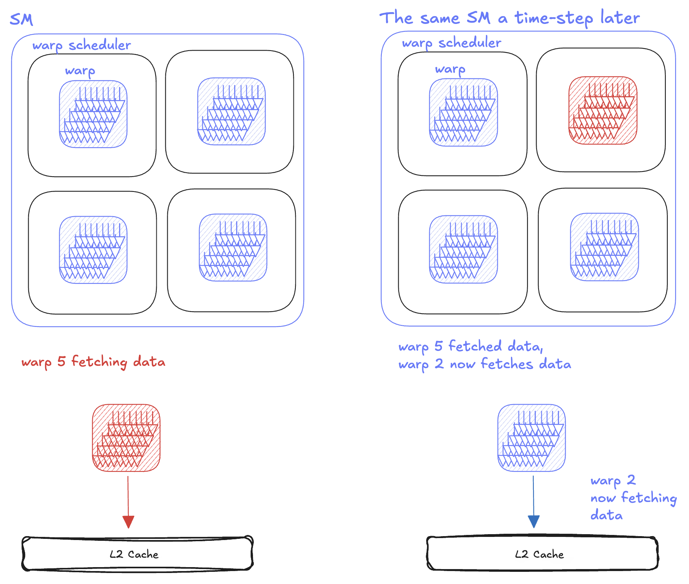
///caption
Example of optimized warp scheduling
///

This programming paradigm is not exclusive to Blackwell, the grouping of
threads into warps has been the case for virtually the past 2 decades—since
NVIDIA’s Tesla architecture.

### Thread block clustering

On Hopper and Blackwell, programmers can group multiple CTAs into a cluster. A
cluster guarantees that its blocks are scheduled on SMs that are physically
connected within the same GPU Processing Cluster (GPC). This proximity allows
blocks on different SMs within the cluster to directly access each other’s
shared memory, bypassing global memory and effectively enlarging the available
shared memory space. As a result, the GPU execution hierarchy now includes an
additional layer: the cluster, positioned between the block and the grid.


///caption
Thread block clustering
///

Visualized, this how a cluster will get scheduled on the GPU:

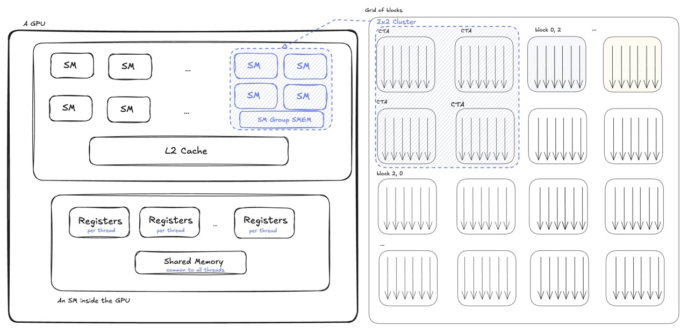
//caption
Thread block cluster scheduling
///

Now that we’ve explained the entire GPU programming paradigm, we can almost
write our first kernel. However, before we do so, let’s take a trip down memory
lane and look at the evolution of the GPU hardware, and what features the
hardware provides to enable us to squeeze the best performance out of each GPU.

## NVIDIA’s GPUs - a look over the past 3 generations

### NVIDIA's Ampere architecture

Released in May 2020, Ampere advanced  Tensor Cores considerably (even though
tensor cores were introduced a few generations earlier) From a spec point of
view, Ampere had:

- 108 Streaming Multiprocessors (SMs)
- 4 Tensor Cores per SM
- 80GB High Bandwidth Memory (up to 2.0 TB/s)
- 192KB combined Shared Memory + L1 cache per SM
- 65,536 registers per SM
- 40MB L2 Cache shared between all SMs
- Asynchronous copies to allow deeper software pipeline between global ->
  shared memory copies

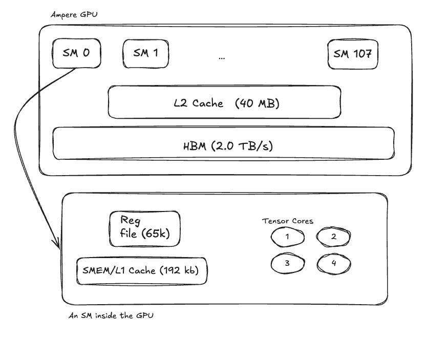
///caption
Ampere architecture
///

### NVIDIA's Hopper architecture

Released in late 2022, Hopper improved upon  Ampere, and is still considered
for wide LLM deployments today. Hopper had the following specifications:

- 132 Streaming Multiprocessors (SMs)
- 4 Tensor Cores per SM
- 80GB High Bandwidth Memory (3.35TB/s)
- 256KB combined Shared Memory + L1 cache per SM
- 65,536 registers per SM
- 50MB L2 Cache shared between all SMs
- Introduced a TMA engine to optimize block memory copies
- Is not forward compatible with next generation hardware

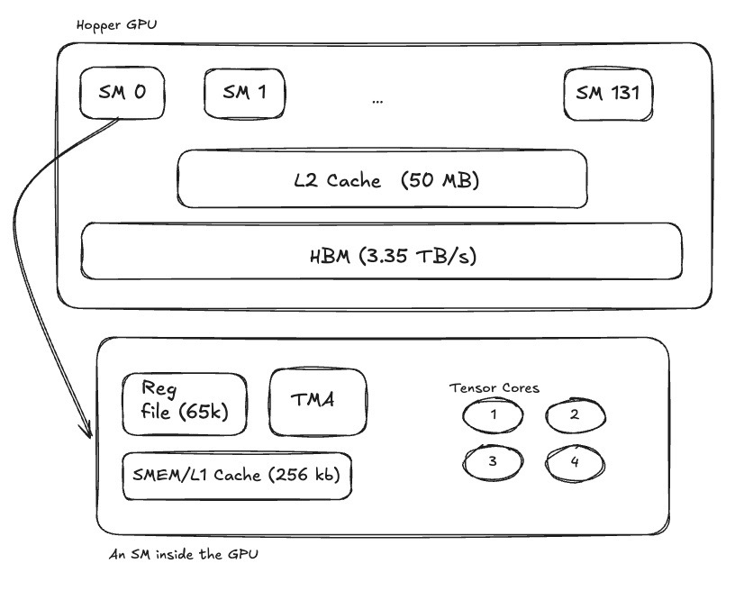
//caption
Hopper architecture
///

### NVIDIA's Blackwell architecture

Blackwell is the latest NVIDIA architecture and is currently the SOTA
architecture for LLM deployment. It improved upon Hopper and Ampere by
increasing the compute capacity as well as providing a few key features to
enable faster execution:

- 148 Streaming Multiprocessors (SMs)
- 4 Tensor Cores per SM
- 7.672 TB/s High Bandwidth Memory
- 228 KB combined Shared Memory + L1 cache per SM
- 65,536 registers per SM
- 192 MB L2 Cache shared between all SMs
- 5th Generation Tensor core architecture
- **256 KB of Tensor Memory**

Blackwell’s architecture can be more or less visualized as follows:

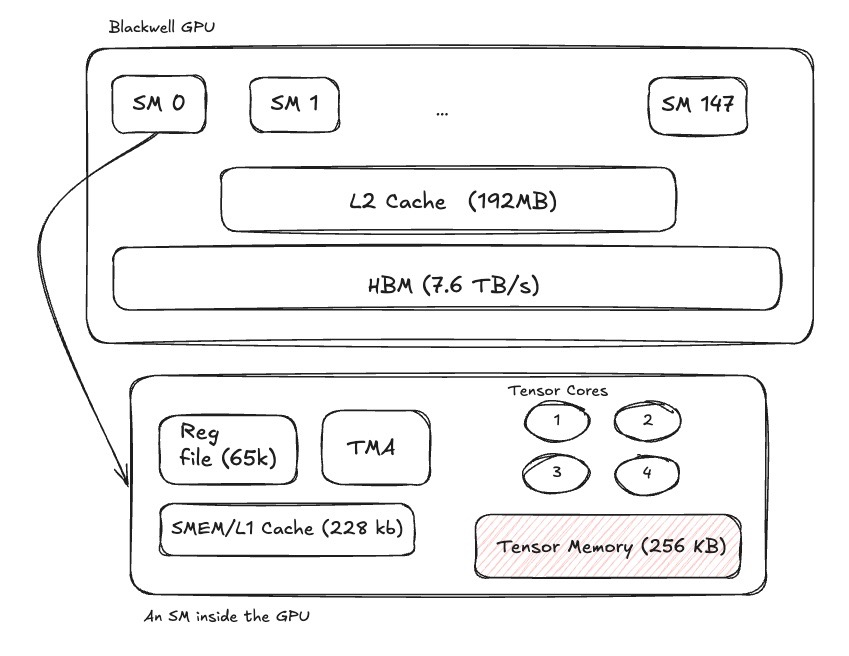
///caption
Blackwell architecture
///

### GPU comparison at a glance

To give the reader’s a sense of the magnitude of the differences, here’s a
table comparing peer-to-peer performance:

| Metric | A100 (Baseline) | H100 | H200 | B100 | B200 |
| --- | --- | --- | --- | --- | --- |
| **Peak Memory Bandwidth** | 1.0x | 1.6x | 2.4x | 3.9x | 3.9x |
| **NVLink Bandwidth** | 1.0x | 1.5x | 1.5x | 3.0x | 3.0x |
| **Peak BF16 TFLOPS (dense)** | 1.0x | 3.2x | 3.2x | 5.6x | 7.2x |
| **Peak FP8 TFLOPS (dense)** | N/A | 1.0x | 1.0x | 1.8x | 2.3x |

As the GPU becomes more powerful in terms of FLOPs/s and bandwidth, the
programming model to achieve this peak performance also evolves. Below is a
review of the optimal operation scheduling on different architectures.

### Pre-Ampere optimization

Ampere introduced asynchronous data movement. Before Ampere, memory operations
blocked compute, and we had to do something like: Load data from global → Wait
→ Compute → Wait → Store results


///caption
Pre-Ampere optimization
///

As a result, one would perform double buffering operations on pre-Ampere
architecture and use multiple CTAs per SM for overlapping data transfer and
computation. This caused contention for the SM’s limited memory resources, and
force trade-offs between memory latency and optimal tiling.

### Ampere optimization

With Ampere's async copy instructions (`cp.async`), one can pipeline the data
loading and MMA operations and achieve overlap within a single CTA.

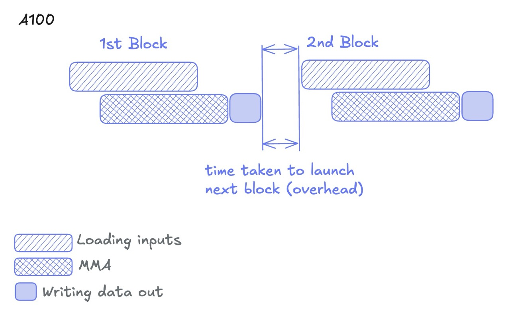
///caption
Ampere optimization
///

Using the `cp.async` instruction, threads can issue memory copies and
immediately move on to next work, hiding memory transfer latency behind mma
operations.

<aside>
✅ Ampere’s win: Overlapping input loads with computation
<br>
❌ Ampere’s problem: CTA launch overhead
</aside>

### Hopper optimization

Hopper architecture introduces new instructions for data transfer and mma:

1. TMA (Tensor Memory Accelerator): TMA is a dedicated hardware unit for moving
   multi-dimensional tensors. Instead of each thread calculating addresses and
   loading individual elements, TMA transfers a tensor tile asynchronously
   between global and shared memory.

2. Asynchronous Warpgroup MMA (WGMMA):  While Ampere enables overlapping MMA
   (synchronous instructions) with data transfer, the WGMMA instructions are
   asynchronous and allow overlapping of the mma with not only the memory
   access, but also core computations.

As a result of this, a new paradigm of matmul development arose which is called
Persistent Kernels. This technique will be discussed in depth in subsequent
blog posts, but at a high level, it allows CTAs to stay resident on an SM and
process multiple tiles without returning to the host. This eliminates kernel
launch overhead and overlaps one work tile's output with next tile's loading.


///caption
Hopper optimization
///

<aside>
✅ Hopper’s win: Reducing CTA launch overhead and overlap data transfer across
tiles.
<br>
❌  Hopper’s problem: WGMMA consumers use lots of registers and
contention between the tensor core and the ALUs.
</aside>

### Blackwell optimization

Blackwell architecture introduces tcgen05 instructions and tensor memory, where
the MMA's result is stored on new, dedicated hardware- tensor memory. This
breaks the WGMMA’s dependency on registers. We can now leverage even more
pipelining without polluting those registers.


///caption
Blackwell optimization
///

This creates a three-stage pipeline:

1. **Loading inputs** (TMA) - load the data via the TMA engine
2. **Computing MMA** (Tensor Cores) - compute the MMA operations and write into
   tensor memory
3. **Storing outputs** (from Tensor Memory) - store the results from tensor
   memory into global memory

All three stages can run concurrently on different memory regions. Thus tile N
computes, tile N+1 loads, and tile N-1 writes out -- forming a software
pipeline.

<aside>
✅ Blackwell’s win: pipelining the write-out stage
<br>
❌ Blackwell’s problem: Tensor memory only supports very limited instructions
</aside>

As shown, the algorithm for achieving peak performance becomes more
sophisticated as the hardware advances. In fact, the CUDA programming model
also falls short- lots of the instructions, like tcgen05, are only available in
PTX. This is not ideal, and is where Mojo steps in to fill the gap.

## Matmul in four lines

Armed with the understanding of GPU programming and the hardware, we can now,
*finally*, translate our matmul function over to a GPU matmul kernel. This is
trivial, and can be done like so:

```mojo
acc = Float32(0)
for k in range(K):
    acc += a[global_idx.y, k] * b[global_idx.x, k]
c[row, col] = acc
```

We created a 2D grid of threads large enough to cover our entire C matrix:

- Each thread computes one element of the output matrix C, and that element is
  based on that thread’s unique id

    ```python
    row = global_idx.y
    col = global_idx.x
    ```

- Thread blocks are mapped to tiles of the output matrix

The kernel does this dot product for every output in the C matrix, all at once.

 in the Mojo
Manual

```mojo
fn matmul_kernel[
    M: Int, N: Int, K: Int
](
    c: LayoutTensor[DType.bfloat16, Layout.row_major(M, N)],
    a: LayoutTensor[DType.bfloat16, Layout.row_major(M, K)],
    b: LayoutTensor[DType.bfloat16, Layout.row_major(N, K)],
):
# previous 4 lines of code
```

This allows us to abstract away the algebra required to index/offset into
memory to fetch it (for instance, for matrix A, that would’ve been `a[row * K +
col]` ).

### Data types and casting

Since we are interested in LLMs, and since BFloat16 is the most popular data
type in LLMs, we will be using BFloat16 throughout this series. This is a half
float data type which is stored in 2 bytes of memory, and is similar to the
Float16 data type but comes with additional benefits:


Since the exponent range in BF16 can vary from $-126$→$127$, it can represent a
much larger range of numbers from the traditional FP16 (its maximum positive
value is $3.39*10^{38}$, compared to that of FP16, which is $6.55*10^4$). This
larger range makes it great for deep learning applications and LLMs, where you
need to accommodate gradients over many orders of magnitude, and where
precision of individual values is not critical.

There is however a catch: when accumulating many values (K iterations),
rounding errors in BF16 compound rapidly (because its Mantissa is small, it has
a smaller granularity between hops). To prevent this, we can change our code to
accumulate the intermediates in higher precision:

```mojo
for k in range(K):
 acc += a[global_idx.y, k].cast[DType.float32]() *
     b[global_idx.x, k].cast[DType.float32]()
c[global_idx.y, global_idx.x] = acc.cast[DType.bfloat16]()
```

Using FP32 for accumulation preserves numerical accuracy during the reduction,
while still getting the memory benefits of BFloat16. Note that tensor cores
    would accumulate BFloat16 in Float32 as well. The reduction result is then
    downcast to BFloat16 before storing to global memory.

To measure the performance of our kernel, we run the
[code](https://github.com/modular/modular/blob/main/max/kernels/test/gpu/linalg/matmul_blackwell_iterative/0_naive_sm100.mojo)
and measure how many FLOPS (FLoating-point OPerations per Second) it achieves.
In this setup, we multiply matrix $A (M*K) * B (K*N) = C (M*N)$. There are
$M*N$ elements in the output, each of which took a dot product of size K (K
multiplications and K additions). Hence, our kernel does $(M*N)*2K$ flops in
total, and the performance, in FLOPS, is calculated as $2*m*n*k / time$. Our
kernel gives us 5 TFLOPs.

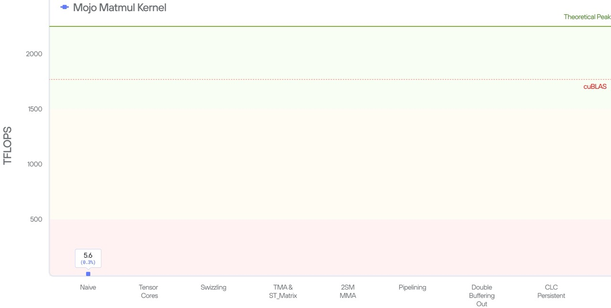
///caption
Performance of naive GPU kernel
///

The 5 TFLOPs is not bad (given that the code is only 4 lines), but is also not
great considering cuBLAS’ SOTA 1763 TFLOPs and a peak theoretical performance
of 2250 TFLOPs on the B200 system.

In the next set of blog posts we will show how we gradually bridge that gap by
leveraging the Tensor cores and the other Blackwell features that we have
discussed.
