- **Authors**: Ali Taha, Jiexiang Liu, Hengjie Wang, Abdul Dakkak
- **Date**: September 5, 2025

In the [first blog post in this series](./matmul-on-blackwell-part-1.md) we
explained Nvidia's Blackwell GPU architecture and concluded with a 4 line
kernel that was a bit worse than cuBLAS. In fact, the performance was *a lot*
worse coming in at 0.3% of cuBLAS and leaving 1758 TFLops on the table.

In this post we are going to continue our journey and improve our performance
by more than 50x our initial kernel benchmark. Along the way we are going to
explain more GPU programming concepts and leverage novel Blackwell features.
Note that this is not the end of the blog series, and we will continue to
improve upon the methods presented here in subsequent blog posts.


///caption
Roadmap of performance improvements for part 2
///

To keep things simple, we will be looking at a specific shape of matmul where
the `A` matrix is `MxK`, the `B` matrix is `KxN` (transposed), and the
resultant `C` matrix is `MxN` with `M=N=K=4096`. We’ll assume the same shape
throughout this blog series; in the last post we’ll show how our techniques
generalize to any shape.

Recall our 4 line matmul from before, and let’s zoom in on the core
computation:

```mojo
acc += a[row, k].cast[DType.float32]() * b[col, k].cast[DType.float32]()
```

Each Fused Multiply Add (FMA) operation requires two
[global](https://docs.modular.com/glossary/gpu/memory) loads and one memory
write. The issue with global memory is that, while abundant, it's considerably
slower than other kinds of memory. Therefore the craft of optimizing matmul is
how to avoid or hide the memory loads and stores by leveraging the [memory
hierarchy](https://en.wikipedia.org/wiki/Memory_hierarchy) available on the
GPU. The following figure visually explains the latencies of different
operations we will be using over the course of this series.  

](./img/matmul-on-blackwell-part-2/image02-LatencyComp2.gif)
///caption
🔥 How can you get your kernel to be as far to the right of this
graph as possible? [Source: Intro to
GPUs](https://www.vrushankdes.ai/diffusion-policy-inference-optimization/part-i---intro-to-gpus)
///

Taking a step back, we can visualize the memory access for our 4-line matmul by
assigning a different color to each thread, then illustrate how each thread
reads data from the input matrices.


///caption
Memory access by thread for the 4-line matmul
///

- Thread 0 computes C[0, 0], reads row 0 in A and column 0 in B
- Thread 1 computes C[0, 1], reads row 0 in A and column 1 in B
- Thread 2 computes C[1, 0], reads row 1 in A and column 0 in B
- Thread 3 computes C[1, 1], reads row 1 in A and column 1 in B

Considering just four threads, note that each thread loads one complete row and
one complete column to calculate a single output value. If we count the number
of memory loads for all fours threads, the load for each row and column is
repeated twice. These observations point us towards the first improvements that
we can make: reducing slow global memory access.

## Shared memory

A common technique to reduce redundant loads is called [loop
tiling](https://en.wikipedia.org/wiki/Loop_nest_optimization). The idea of
tiling is simple. One loads small tile of the matrix into a much faster memory
cache, so the processor can perform all the necessary calculations on that
block of data without constantly having to go back to the slow main memory.
Once it's finished with one tile, it loads the next one.

We'll use shared memory as a cache, and since each Blackwell SM gives us 228KB
of shared memory, it means that we *could* share data between multiple threads
and perform tiling across a block. Here’s what we’ll do:


///caption
Loop tiling for matrix multiplication
///

We will partition our matrix into tiles, `BMxBK` tiles for matrix `A`, and
`BNxBK` tiles for matrix `B`, where `BMxBNxBK=64x64x64` . We will discuss the
possible numbers and the restrictions later, but for now, these can be treated
as tiles for our `4096x4096` square matrices. The only constraint that we
should be aware of right now is that the tile doesn’t exceed the size of shared
memory.

For the first iteration within a `K/BK` loop, we load a tile of size `BMxBK`
from matrix `A` and `BNxBK` from matrix `B`. We know this can fit into our
shared memory, since that’s two `64x64` tiles, or `8192` 2-byte elements. This
results in a memory requirement of about 16KB for each block, which is far less
than the 228KB of available shared memory. We then perform the
matrix-multiply-accumulate (MMA) operation on this tile, and store the result
as an intermediate value:


///caption
Matrix-multiply-accumulate using loop tiling
///

In the second iteration, we load the next two chunks into shared memory, and we
**add** the result of this MMA to the result from the previous iteration.This
keeps going on for K/BK iterations (in our case 256 iterations) until we reach
the result of the final tile. Once the  K/BK loop in done, we will have the
final output tile. The final result for that tile can then be written **only
once to** global memory.

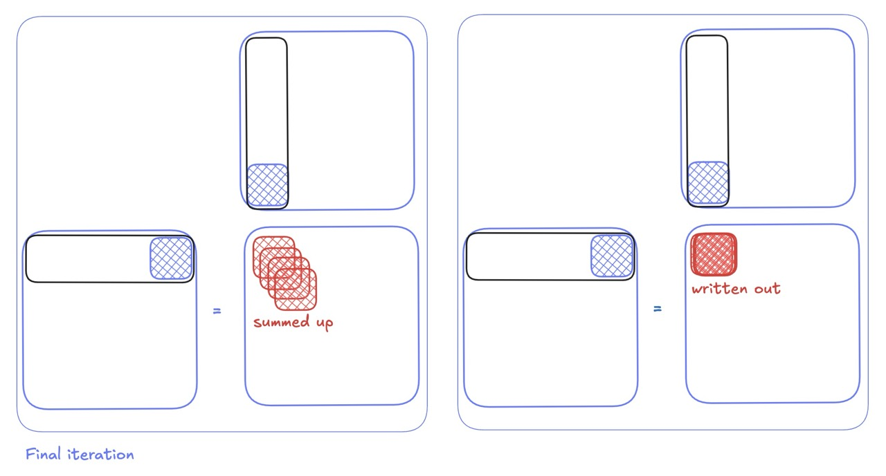
///caption
Writing the final result into global memory
///

With this idea sketched out, we can now move on to our second, improved matmul
kernel implementation.

## Kernel 2: TMA and tensor cores

In this section we will develop our next kernel. Kernel 2 is more advanced that
the initial kernel and will use both tiling and tensor cores for optimization.
As a rough idea, here is what the kernel will do:

```mojo
kernel_setup()

for i in range(K // BK):
    load_tiles_ab()               # leader thread loads A and B tiles
    issue_mma_axb()               # leader thread issues MMA(A x B)

transfer_c_tile_to_registers()    # move final C tile from tmem to registers
write_c_tile_to_global_memory()   # store C tile from registers to gmem
```

We will store our `B` matrix in its transposed form to ensure coalesced layout
when accessing. This can be done via a
[Layout](https://docs.modular.com/mojo/kernels/layout/layout/) transform:

```mojo
alias a_layout = Layout.row_major(M, K)
alias b_layout = Layout.row_major(N, K) # Transposed
...
```

The kernel does require some host setup changes, and we will explain the needed
changes on the host incrementally.

### Loading tiles into shared memory

The Nvidia Hopper architecture introduces the Tensor Memory Accelerator (TMA),
a specialized hardware unit that transfers data between the GPU’s global memory
(GMEM) and shared memory (SMEM) asynchronously.

To use the TMA, we need to first create a [tensor
tile](https://docs.modular.com/mojo/kernels/layout/tma_async/create_tma_tile)
on the host and pass it to the kernel. The tensor map is a 128B data chunk
encoding the input tensor's shape, the stride, and the global memory address.
(The tensor map can also encode a *swizzling pattern*, an optimization we’ll
discuss a little later.) You can easily create a TMA tile in Mojo using the
provided [APIs](https://docs.modular.com/mojo/kernels/layout/tma_async/):

```mojo
# Rank 2 matrix
# A/B tiles in shared memory have shapes BMxBK and BNxBK, respectively
a_tma_op = create_tma_tile[
    a_type, 2, Index(BM, BK)
](ctx, a_global_mem_address)

b_tma_op = create_tma_tile[
    b_type, 2, Index(BN, BK),
](ctx, b_global_mem_address) 
```

Below is how we use the TMA object within the kernel:

```mojo
alias num_iters = K // BK

for i in range(num_iters):
  # One a single thread launches the TMA async copy.
    if elect_one_thread:
        tma_mbar[0].expect_bytes(expected_bytes)

        a_tma_op.async_copy(
            a_smem_tile,  # shared memory tile containing the address
            tma_mbar[0],  # barrier to guard the copy is finished
            (i * BK, block_idx.y * BM),  # tile's coordinate in the input.
        )
        
        b_tma_op.async_copy(
            b_smem_tile,
            tma_mbar[0],
            (i * BK, block_idx.x * BN),
        )
    # All threads wait for the copy to finish.
    tma_mbar[0].wait(tma_phase)
    tma_phase ^= 1
```

At a high level, one thread (`elect_one_thread`) launches the asynchronous
copies and use a memory barrier (`tma_mbar`) to guard that the copies are
completed. Let’s go through this one at a time.

`a_tma_op.async_copy` takes three arguments:

- `a_smem_tile:` a `LayoutTensor` providing the tile’s shared memory address.
- `tma_mbar:` a memory barrier to track how much data has been transferred.
- `(i * BK, block_idx.y * BM):` is the current tile’s coordinates in global
  memory, depending on the iteration and block coordinate (see post 1).

#### The need for a TMA barrier

Because the TMA operation is async, we need to implement some way to ensure the
mma cannot proceed until the tiles are fully resident in shared memory**.**
This is why we use a memory barrier (`mbar`), such that the threads will
wait/block on this barrier until the tiles are copied to shared memory.

This is done by initializing each thread with its own barrier phase
(`tma_phase=0`). The memory barriers have *their* internal phase value
initialized also to `0`. When the phase of a thread matches the phase of the
barrier, the thread can not ****unlock the barrier, and it can not pass. Only
when the two phases differ can the thread proceed.

```mojo
tma_mbar[0].wait(tma_phase)
```

The above code causes the threads to block and if we trace the execution it
would look like:


///caption
Illustration of thread blocking with TMA barrier
///

Prior to the TMA transfer, the barrier is initialized with how many bytes to
expect from the TMA with `tma_mbar[0].expect_bytes(expected_bytes)` . The
expected bytes is the total number of bytes in both transferred tiles.

```mojo
alias a_expected_bytes = a_size * sizeof[a_type]()
alias b_expected_bytes = b_size * sizeof[b_type]()
alias expected_bytes = a_expected_bytes + b_expected_bytes
```

The TMA continuously updates the barrier with the number of bytes it has
transferred, and once the number of bytes transferred reaches that of the total
bytes, the phase of the barrier flips and the threads can proceed.

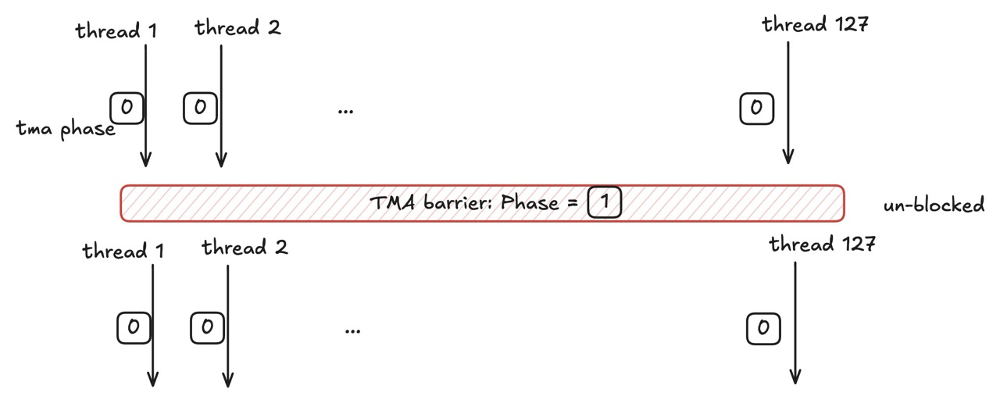
///caption
TMA barrier phase flipping
///

We then manually toggle the `tma phase` of each thread via `tma_phase ^= 1` to
ensure that the threads block on the next iteration until the TMA transfers
*that* iteration’s tile into shared memory.


///caption
Manually toggling TMA barrier phase
///

Mojo does provide abstractions that hide some more TMA details and optimization
tricks for you. For example, if we ask you what the `a_tma_op` layout is, what
would your answer be?

<aside>
💭 We said the tile is `BM x BK`, so if `BM` is `64` and `BK` is 64,
then the `((shape), (stride))` tuple is `((64, 64):(64, 1))` , given that it is
`Row-Major/K-Major`.  </aside>

And you would, of course, be correct! Then if the question is so how many
fetches will the TMA unit need to load our `64x64` tile?

<aside>
💭 Well, since it’s declared with a `64x64` layout, obviously one.
</aside>

And you would, of course, be wrong. It actually takes 8 fetches to load the
tile. While we specify a logical tile size of `64x64`, the TMA hardware
partitions our `64x64` tile into eight `64x8` sub-tiles, and loads them one at
a time. To explain why we have to do it this way, we need to introduce “core
matrix”.

#### Core matrices

There is a hidden nuance with TMA, Tensor Cores, and Nvidia GPUs at large: the
core matrix.

The concept is simple. tensor cores don’t understand *elements*, they
understand *matrices*. They can only view the matrix as a group of `8x16B`
tiles—that’s core matrices of `8x8` elements as far as we’re concerned.

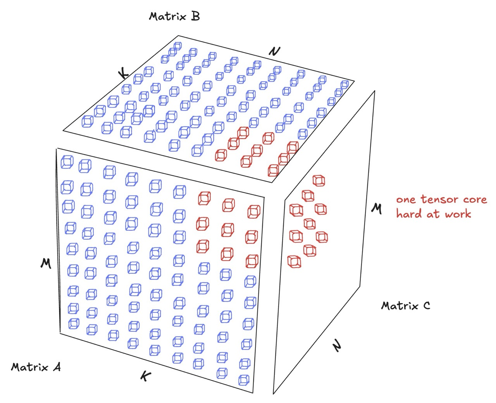
///caption
Tensor core matrices
///

`tcgen05.mma`
[supports](https://docs.nvidia.com/cuda/parallel-thread-execution/#asynchronous-warpgroup-level-matrix-shared-memory-layout)
8 canonical layouts of core matrices in shared memory (inherited from WGMMA)
based on the layout (row-major or column-major) and swizzling mode. Our current
kernel uses K-major for both `A` and `B`, corresponding to a layout where each
column of core matrices (8x1) needs to be contiguous in shared memory. This is
why the descriptor layout shows `(64, 8)`—the TMA copies one column of 8 core
matrices at a time, and this operation will be repeated 8 times to fill the
64-element width of the tile.


///caption
Copying 8 columns of core matrices 8 times
///

Of course, our Mojo library’s `async_copy` abstracts this complexity away from
you, such that a programmer only has to issue a copy, and can expect the tile
to show up in shared memory.

### Issuing the MMA instructions

To recap a bit, the 5th generation tensor cores introduced in Blackwell come
with a new set of instructions (`tcgen05` instructions) and 3 fundamental
improvements  for the MMA operation:

1. Increasing the largest `tcgen05.mma` shape to `128×256×16` for a single SM,
   compared to the previous `64x256x16` on Hopper. This means we almost double
   the throughput.
2. Introduced 2SM `tcgen05.mma` with up to `256x256x16` (we will explain the
   2SM operation in a subsequent blog post in this series).
3. Decreased register pressure by introducing a new kind of memory called
   Tensor Memory. This allows the `tcgen05.mma` instruction to store its result
   in Tensor Memory instead of register memory. But what is tensor memory?

#### What is Tensor Memory?

There is another improvement in Blackwell which we mentioned briefly in the
first part of this blog series, and that is Tensor Memory (TMEM).


///caption
Tensor memory (TMEM)
///

TMEM is a 256K on-chip memory space specialized to store the input or output
for `tcgen05` MMA instructions. There are 128 lanes of 512 columns, for a total
    of 65,536 elements. Each element is 4 bytes, for a total of 256KB.
    Allocation is done by columns, and the granularity of allocation is 32
    columns, meaning the smallest you can allocate is 32 columns (16k bytes) at
    a time.

Prior Nvidia generations would have had to use general purpose registers to
store matmul results which has a few issues:

1. Register space is scarce, with only 64k registers per SM. Thus there was a
   contention between the Tensor Cores and the general purpose ALUs.
2. Registers are thread-private while MMAs were wrap-level operations in pre
    Blackwell GPUs. Thus the warps launching an MMA operation needed to wait
    for its completion and continue tasks that depended on the MMA result e.g.
        epilogue.

TMEM addresses these issues, separating the concerns between the the registers
used by the ALU from the ones required by the Tensor Cores.

This is how we make use of `tcgen05.mma` and tensor memory in our code:

```mojo
for i in range(num_iters):  
  load_tiles_ab()  #section 1 
  if elect_one_thread:
      @parameter
      for j in range(num_k_mmas):
          alias idx = IntTuple(0, MMA_K * j)
          alias a_offset = a_smem_layout(idx) * sizeof[a_type]()
          alias b_offset = b_smem_layout(idx) * sizeof[b_type]()

          # Use c_scale=0 for the first mma to initialize results and use 
          # c_scale=1 subsequently to accumulate resutls.
          var c_scale_value: UInt32 = 0 if (i == 0 and j == 0) else 1
          mma(
              adesc + a_offset,
              bdesc + b_offset,
              tmem_addr,
              idesc,
              c_scale=c_scale_value,
          )

      mma_arrive(mma_mbar)

  mma_mbar[0].wait(mma_phase)
  mma_phase ^= 1
```

The `tcgen05.mma` instruction is executed asynchronously and is similar to the
to TMA operations—being launched by a single thread and guarded by a memory
barrier. The difference is here we use `mma_arrive` which wraps
`tcgen05.commit` to signal the memory barrier and link it with the MMA
instructions on-the-fly.

Note that we issue `num_k_mmas` MMA instructions (instead of just feeding both
A and B tiles, once, to the tensor cores, and multiplying them together). The
reason we do that is because the  `BM×BN×BK` tiling is not sufficient because
the actual hardware instruction has size restrictions. The `tcgen05.mma`
instruction requires the K dimension to be 32B (i.e. 16 elements for
BF16/FP16). Therefore the MMA takes 4 iterations for `BK = 64`.


///caption
MMA requires 4 iterations for BK=64
///

And, yes, this means we are doing a nested tile strategy. The `mma` function
invokes the `tcgen05.mma` instruction, which accumulates result in the tensor
memory at address `tmem_addr`. To allocate the tensor memory one needs to
perform:

```mojo
    # allocate all 2^18 bytes of smem for tcgen05, all 512 cols allocated
    if elect_one_warp:
        tcgen05_alloc(ptr_tmem_addr, max_tmem_cols)

    # Ensure all threads see initialized mbarrier and
    # tensor memory allocation
    barrier()

    tmem_addr = ptr_tmem_addr[0]
```

This allocation turns out to be quite non-trivial. First the allocation needs
to be issued by a single warp (not a single thread). Moreover, we have to
detour to shared memory get the allocated `tmem` address.

The inputs and configurations for `tcgen05.mma`are encoded into descriptors:

1. **I**nstruction descriptor (`idesc`): This encodes the instruction shape,
   data type, matrix layout, etc. This descriptor does not change during
   iterations since these properties remain constant throughout the
   computation.
2. Shared memory descriptors (`adesc` and `bdesc`): These encode information
   about the shared memory layout and access patterns for matrices `A` and `B`.
   These descriptors do change and are incremented across `num_k_mma`
   iterations, because the shared memory addresses change as we move through
   different K-slices of the matrices.

<aside>
A deeper dive into this is provided in the Appendix.
</aside>

And then, once the MMA is complete, it will arrive on the `mma barrier`. This
works basically the same way as the `tma barrier`, blocking all threads until
the MMA operation is complete. This way, no one thread proceeds to the next
iteration of launching the TMA operation until all MMA operations on the
current tiles are complete.

### TMEM → registers

We’ve now essentially covered the two main functions:

```mojo
for i in range(K // BK):
    load_tiles_ab()              # leader thread loads A and B tiles
    issue_mma_axb()              # leader thread issues MMA(A x B)
```

The results have been accumulated and stored in tensor memory. The next
question is, how can we get it out of tensor memory and into global memory?

The only way to move data out from tensor memory is to move the data into
registers first. This can be done via the `tcgen05_ld` operation:

```mojo
c_frag = tcgen05_ld[
    datapaths=16,
    bits=256,
    repeat = BN // 8,
    dtype=accum_type,
    pack=False,
    width=c_frag_size,
](tmem_addr)

tcgen05_load_wait()  # wait for the load to finish
```

This instruction is pretty complicated, but let’s break it down. If we look at
the documentation on how the data is stored in tensor memory, we observe that
tensor memory holds a `64x64` `C_tile`. The layout organization and access
pattern, according to [Figure
215](https://docs.nvidia.com/cuda/parallel-thread-execution/index.html?highlight=tcgen05%2520mma#tcgen05-data-path-layout-f1)
in Nvidia’s [Parallel Thread Execution ISA Version
9.0](https://docs.nvidia.com/cuda/parallel-thread-execution/index.html), is as
follows:

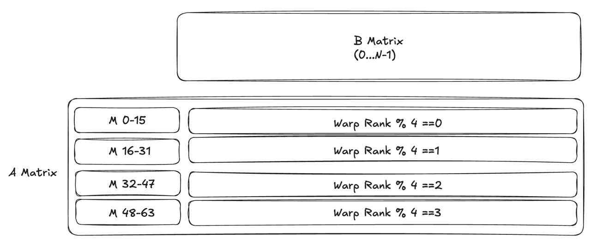
///caption
Layout organization and access pattern for tensor memory
///

So to access the memory, each warp in our launched block will need to read out
16 lanes, and the entire warp-group (4 warps), reads out the 64 lanes. The
parameters (datapaths and bits) specify this load pattern and `tcgen05_ld`
dispatches the `tcgen05.ld.16x256b` instruction internally to load each set of
lanes.

This means that each iteration, the threads will load 256 bits, or 8 elements
(not 16, as if you recall from our first blog that we accumulate the results in
FP32 to preserve accuracy, and each element is thereby stored in a 4 byte spot
in tensor memory) across the columns of tensor memory, for `BN/8` iterations.
This means each one of 32 threads within the warp must hold 4 elements
(see [Figure
185](https://docs.nvidia.com/cuda/parallel-thread-execution/index.html?highlight=tcgen05%2520mma#tcgen05-mma-fragment-16128b)).

Repeat this `BN//8 = 8` times, and each thread now holds 32 elements of the
tile in an array of registers. Once this is done, we know that we’re
successfully transferred all the data into our registers, and, de-allocate the
tensor memory that we allocated.

```mojo
if elect_one_warp:
    tcgen05_release_allocation_lock[1]()
    tcgen05_dealloc[1](tmem_addr, max_tmem_cols)
```

### Registers → GMEM

In terms of code, here is where we are now:

```mojo
setup_kernel()

for i in range(K // BK):
    load_tiles_ab()              # leader thread loads A and B tiles
    issue_mma_axb()               # leader thread issues MMA(A x B)

transfer_c_tile_to_registers()    # move final C tile from tmem to registers
```

We’re still missing a key step: `write_c_tile_to_global_memory`which moves the
data from registers into global memory. To move the data, we begin by
identifying *where* we want to write this data out to. Our matrix is 4096x4096.
Each block is responsible for a `64x64` tile of this output. If we focus our
attention on say `block_idx.y = 2, block_idx.x = 2`, this is responsible for
outputting the 3rd tile of row 3:

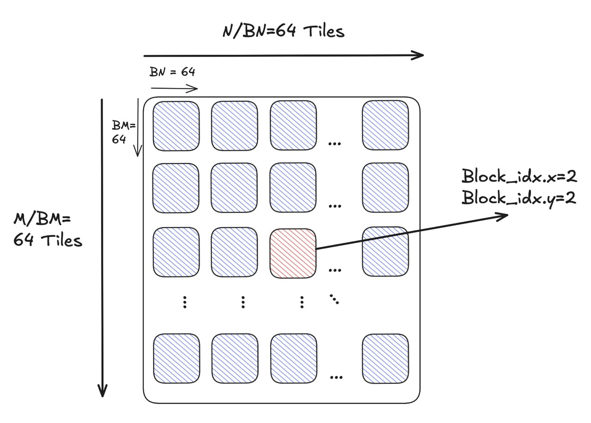
///caption
Outputting the 3rd tile of row 3
///

We use the `LayoutTensor.tile()` method to extract a tile of the output matrix:

```mojo
ctile = c.tile[BM, BN](block_idx.y, block_idx.x)
```

Then we further tile it for each warp:

```mojo
c_gmem_warp_tile = ctile.tile[BM // num_warps, BN](warp_id, 0)
```

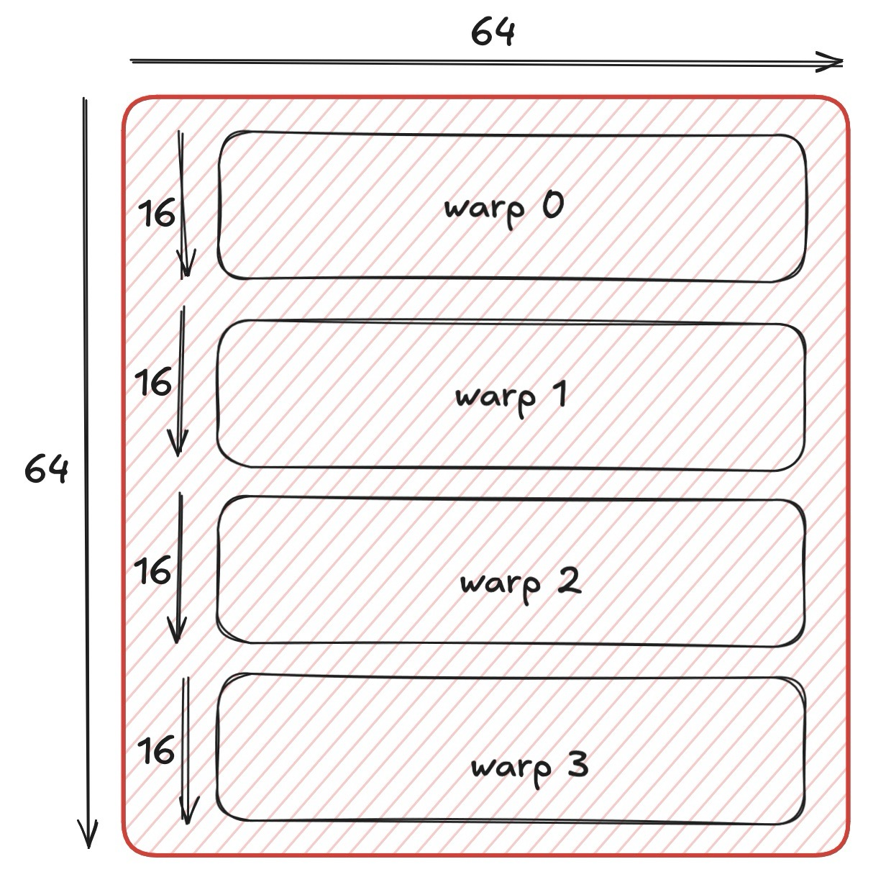
///caption
Tiling the output matrix for each warp
///

Let’s focus on the tile of `warp 0`, and how it will be affected.
`c_gmem_warp_tile` of `tile 0` represents the first 16 rows by 64 columns
(`16xBN`) and we need to map this 16 by 64 tile to `warp 0` since that is where
the accumulator values are stored.  The following plot shows how elements are
mapped to lanes (threads) for the
[`tcgen05.ld.16x256`](https://docs.nvidia.com/cuda/parallel-thread-execution/#tcgen05-matrix-fragments-shape-16256b)
PTX instruction:


///caption
Mapping of elements to threads for the `tcgen05.ld.16x256` PTX instruction
///

There is quite some indexing involved. What if there was some way for us to
create views—or little pockets—into the warp’s tile to give each thread a
layout of exactly ****the pockets it needs to put its data into? Wouldn’t that
be cool? If only we had a library function that did this. Mojo provides such a
function, so this can be done succinctly:

```mojo
c_gmem_frag = c_gmem_warp_tile.vectorize[1, 2]().distribute[
    Layout.row_major(8, 4)
](lane_id())
```

This might be a bit complicated for folks who have just had their first look at
`LayoutTensor`, so let’s visualize the view for `thread 0`. The first part of
the code realizes that, since each thread stores 2 consecutive elements, the
16x64 tile can be viewed as a 16x32 tile of 2-value vectors each:

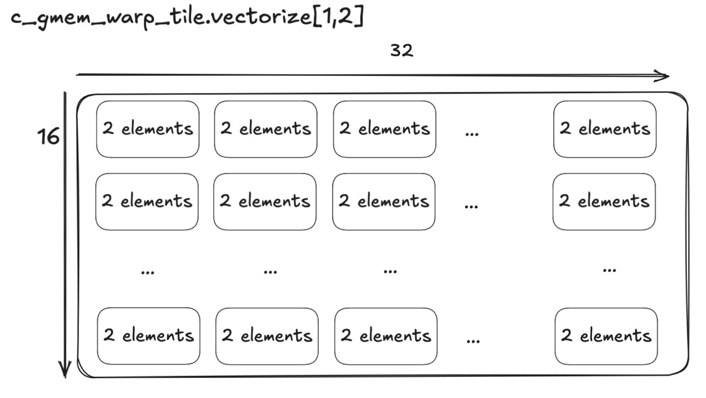
///caption
A 16x64 tile can be viewed as a 16x32 tile of 2-value vectors each
///

This is followed by `.distribute[Layout.row_major(8, 4)]` which distributes the
16x32 vectors over 8x4 threads repeatedly as demonstrated below.

The offset is calculated as `row_major(8, 4)(lane_id())`. For example, `thread
0` gets the vector at `(0, 0)` in all the sub-matrices (green cell) and `thread
6` gets the vector at `(1, 3)` similarly (blue cells in the figure below). In
fact, each submatrix maps identically to Nvidia’s layout in [Figure
185](https://docs.nvidia.com/cuda/parallel-thread-execution/index.html?highlight=tcgen05%2520mma#tcgen05-mma-fragment-16128b):

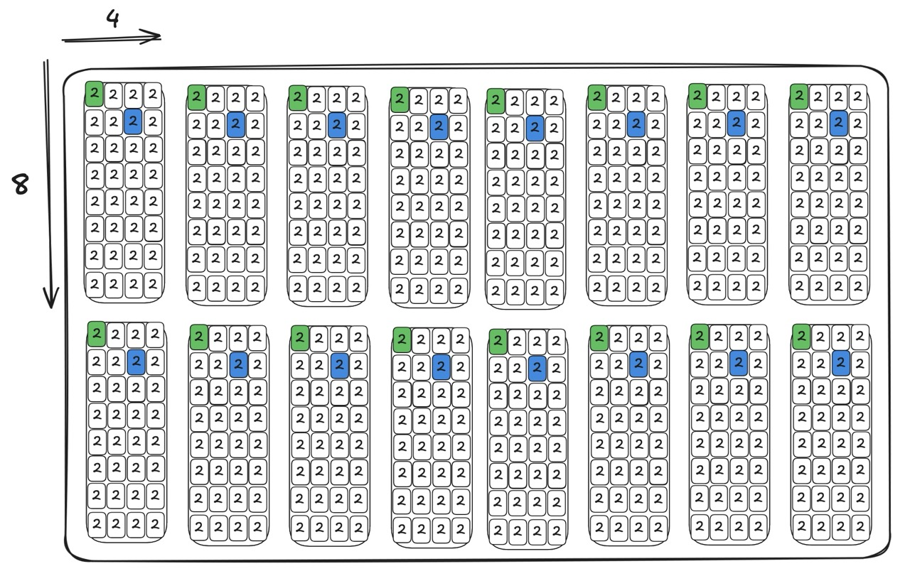
///caption
Submatrix mapping
///

This results in `2x8` sub-matrices, each sub-matrix storing `8x4` 2-value
vectors. Furthermore, `distribute` gives each thread the view of the pockets it
needs, just as we promised.


///caption
Comparing the distribute operation to NVIDIA's mapping
///

With this mapping, the output to global memory is trivially accomplished by a
loop:

```mojo
alias num_vecs_m = c_gmem_frag.shape[0]()
alias num_vecs_n = c_gmem_frag.shape[1]()

@parameter
for n_vec in range(num_vecs_n):
    @parameter
    for m_vec in range(num_vecs_m):
        alias i_vec = n_vec * num_vecs_m + m_vec
        c_gmem_frag[m_vec, n_vec] = [c_frag[2 * i_vec], c_frag[2 * i_vec + 1]]
```

Using `num_vecs_n, num_vecs_m=(8,2)` as an example means that across each warp,
we write out one sub-matrix at a time, first twice across the `M` dimension,
then eight times across the `N` dimension. Here’s a quick overview of our loop
in action:


///caption
iteration `n_vec=0, m_vec=0`, one warp
///


///caption
iteration `n_vec=0, m_vec=1`, one warp
///


///caption
iteration `n_vec=1, m_vec=0`, one warp
///


///caption
final iteration `n_vec=7, m_vec=1`
///

The above is for a single warp. If we zoom out at the CTA level, we can map the
CTA’s tile to the `C` matrix in global memory as follows:


///
Mapping a CTA's tile to the `C` matrix in global memory
///

### Setup shared memory for everything above

Before looking at how to setup the shared memory, let’s first examine what our
shared memory stack looks like on the SM, which is the `setup()` phase we've
skipped as far. We use shared memory primarily for the input tiles, memory
barrier, and TMEM allocation.

```mojo
var a_smem = external_memory[Scalar[a_type],
              address_space = AddressSpace.SHARED]())
# Offset BMxBK for A tile            
var b_smem = (a_smem + a_size).bitcast[Scalar[b_type]]()
# Offset BNxBK for B tile
var tma_mbar = (b_smem + b_size).bitcast[Int64]()
# Offset 8B for tma memory barrier
mma_mbar = tma_mbar + 1
# Offset 8B for mma memory barrier
ptr_tmem_addr = mma_mbar + 1
```

The setup code above grabs the base address from dynamic shared memory
allocation (`external_memory`), then grows the offset as shown below.


///caption
`async_copy()` operation copying tile blocks to shared memory
///

Putting things together, and benchmarking this kernel, we end up getting 155.0
TFLOPS, this is a **28x** improvement over our naive kernel. But, to put things
in perspective, the kernel is still operating at 8.7% of cuBLAS’ performance.

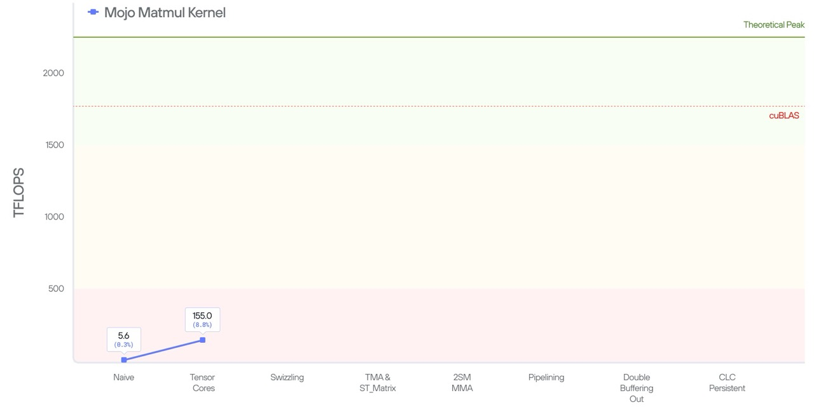
///caption
Performance of TMA and tensor core optimizations
///

## Kernel 3: swizzling

One overhead Kernel 2 has is launching multiple TMA calls for loading input
tile. Recall that the reason we had to do that is because `BK=64` , but the
canonical layout needed by tensor core only allows us to copy 16B in K at a
time. There are other layouts supporting larger K dimension per copy e.g. the
widest 128B layout, which is best illustrated by CUTLASS’s
[comment](https://github.com/NVIDIA/cutlass/blob/b2dd65dc864e09688245b316ac46c4a6cd07e15c/include/cute/atom/mma_traits_sm100.hpp#L197):

```cpp
# T = 16B // sizeof(datatype) = 8 for BFloat16
Swizzle<3,4,3> o smem_ptr o ((8,m),(T,2)):((8T,SBO),(1, T ))
```

The math indicates we indeed can use a single row-major tile `BM x BK` with `BK
= 64` (see `8T` above) as long as we combine it with `Swizzle<3, 4, 3>` .
What’s a swizzle? And why the magic pattern of `<3, 4, 3>`? To understand this
better, let’s brush up our understanding of shared memory.

### Shared memory banks

Shared memory consists of 32 consecutive 4B wide banks:


///caption
Shared memory layout of 32 consecutive 4B wide banks
///

Each bank within the shared memory can service one request per cycle, and
multiple threads accessing different banks within shared memory can all be
serviced in the same cycle. That is, `bank 0` services `thread 0`, and `bank
16` services `thread 1`, at the same time.

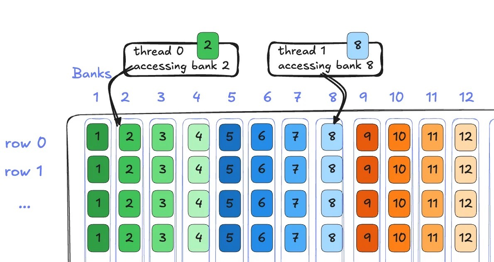
///caption
Multiple threads servicing different banks in the same cycle
///

### Bank conflicts

However, what if two requests access the same bank? For example, consider the
case where two threads access `bank 0` for different addresses, say `thread 1`
now wanted to access the element at `row 3 column 0`.

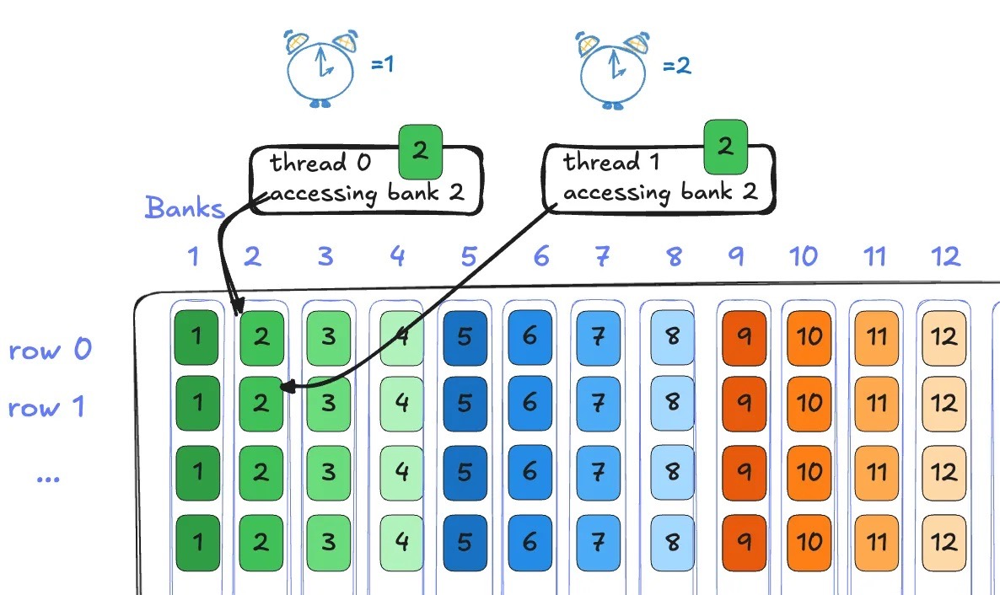
///caption
Two threads accessing the same bank causing bank conflict
///

Now this takes 2 cycles. `Bank 20` first services `thread 0`, and one cycle
later, `bank 2` services `thread 1`. Intuitively, this makes sense. To maximize
throughput, the GPU is designed to load at most 128B per cycle by swiping all
banks (32 banks times 4B per bank). A second load to the same bank needs to be
scheduled in a later cycle.

Recall that the instructions are issued by warp. When threads within a warp try
to access different addresses mapped to the same bank, the hardware has to
break down the execution to multiple cycles.  This stall in execution is called
a bank conflict and obviously it's bad for performance .

If we apply the above to the 128B canonical layout (i.e. the tile is `BM x BK`
and `BK = 64`) then the first core matrix's 8 rows all mapped to same banks
`0-3`.


///caption
8-way bank conflict
///

This would create an 8-way bank conflict per core matrix and cause the write
for each row to happen sequentially. Obviously we need a technique to read the
    required data without the stalls created by bank conflicts.

### Swizzling

Swizzling is a technique to solve bank conflicts. Swizzling uses bitwise XOR
(`^`) to swap indices so that the data does not reside in the same bank. Let’s
show swizzling via an example, let’s assume we have 16 banks for simplicity.


///caption
`Row 0` stays the same by `^00`
///


///caption
`Row 1`: Flip adjacent pairs `(0↔1, 2↔3, 4↔5, ...)` by `^01`
///


///caption
`Row 2`: Flip pairs of pairs `(01 ↔23, 45↔67)` by `^10`
///


///caption
`Row 3`: invert every four values by `^11`
///

Note that the same index `(1-16)` on different rows have been swapped to
different banks. That is, no bank conflict when threads access elements on
different rows by the same index.

#### 128 byte swizzling

Let's decipher the 128B swizzle pattern of `<3, 4, 3>`. The first `3`
corresponds to `2^3 = 8`: the number of rows in the core matrix. `4` maps to
`2^4 = 16B` (the width of the core matrix, 8 elements x 2B). The last `3` is
`2^3 = 8`, which implies 8 chunks of 16B span the entire 32 banks (128B). With
these values, the swizzle function provides the correct XOR pattern to resolve
bank conflicts for core matrices. The pattern [can be written in
Mojo](https://github.com/modular/modular/blob/ee9ecef5f25a708bb58a5b83add273decc407c01/max/kernels/src/layout/swizzle.mojo#L325-L328)
and [generalized for common
patterns](https://github.com/modular/modular/blob/ee9ecef5f25a708bb58a5b83add273decc407c01/max/kernels/src/layout/swizzle.mojo#L542C1-L554C8).
Visually it looks like:


///caption
128-byte swizzling pattern
///

Each 8 elements (`16B = 8*2B`) is grouped by zeroing 3 LSB in the `xor`
operand. The `xor` computation swaps the groups within each row like we showed
before. As a result, every 8 elements exist across different banks. And this
continues as shown below:

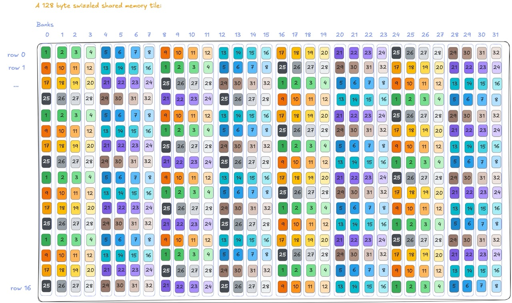
///caption
A 128-byte swizzled shared memory tile
///

The full mathematical details are presented in the appendix. If we look at how
two adjacent core matrices get swizzled onto 32 banks:


///caption
Memory access without swizzling
///

With the swizzle, the above becomes:

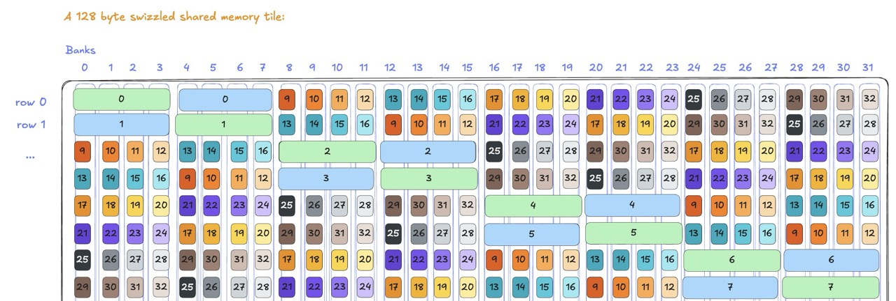
///caption
Memory access with swizzling
///

No two elements from the same core matrix ever end up in the same bank, because
a core matrix has a width of 16 bytes and therefore no bank conflict with the
128 Byte swizzle.

<aside>
🔥 This is why swizzling is extremely useful, and every high-performance GPU
kernel will use it.
</aside>

### The updated kernel

The code changes for the kernel are minimal, since support for
[swizzling](https://en.wikipedia.org/wiki/Swizzling_(computer_graphics)) comes
through the library’s layout tensors and instruction itself. The only code
changes necessary is telling TMA and `tcgen05.mma` which swizzle mode to adopt:

```mojo
alias a_swizzle = TensorMapSwizzle.SWIZZLE_128B
alias b_swizzle = TensorMapSwizzle.SWIZZLE_128B
    
#for the tma, used on writing in data from global memory
alias a_smem_layout = tile_layout_k_major[
    a_type, BM, BK, swizzle_mode=a_swizzle
]()
alias b_smem_layout = tile_layout_k_major[
    b_type, BN, BK, swizzle_mode=b_swizzle
]()

#for the mma
adesc = MMASmemDescriptor.create[aSBO, aLBO, a_swizzle](a_smem_tile.ptr)
bdesc = MMASmemDescriptor.create[bSBO, bLBO, b_swizzle](b_smem_tile.ptr)

```

Since LayoutTensor understands swizzling, we can hide the details of the
swizzle operations behind the layout tensor API and leave our code unchanged.

### Performance

With the above optimizations we are able to achieve 288.3 TFLOPs on B200 (an
87% improvement). In other words, the effects of shared memory bank conflicts
basically cut our performance in half. And, by resolving the bank conflicts we
are 16.4% of cuBLAS and quickly closing the gap.

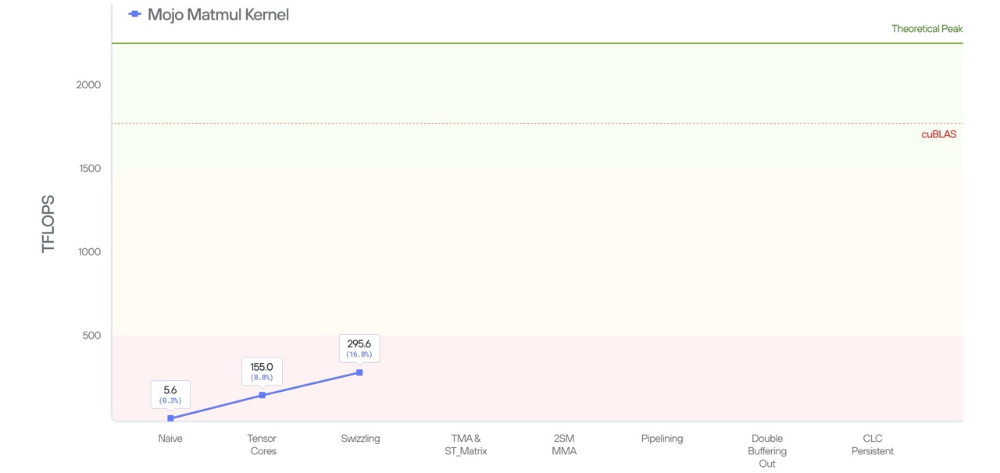
///caption
Performance improvement with the addition of swizzling
///

## Kernel 4: Packing output in shared memory and using TMA store

In the previous kernel's output, we write two contiguous BF16 values to global
memory each time. That's only 4B per store, which is quite small given
Blackwell can support up to 32B per store instruction (`st.global.v8.b32`).
Moreover, we can use TMA to store an entire output tile per instruction to
reduce the number of issued instructions.

### Pack output in shared memory

To leverage TMA store, we need to pack the output data into shared memory. This
is done by copying the registers to shared memory before loading the output
from tensor memory to registers. Since the output in global memory is BF16, we
must cast the registers from FP32 to BF16 before copying them to shared memory.

But, since the output result is fragmented by register in a particular layout
(`16x256` bits load, see TMEM->register section), we need to handle that when
copying the registers to shared memory. Luckily, Nvidia provides the `stmatrix`
instructions to facilitate this step. The `stmatrix` instruction stores 8x16B
core matrices distributed by the exact 16x256 bits layout to shared memory with
the flexibility that users can specify the address in shared memory for each
row. There appears to be a mismatch between 256 bits (32B) and 16B per row.
This is because the data loaded from TMEM is in FP32 and we cast them to BF16
when storing to shared memory. The `stmatrix` instruction stores up to four
core matrixes (2x2) per instruction. As a result, the packing of the `16x64
(BN=64)` warp tile takes four iterations of `stmatrix`.

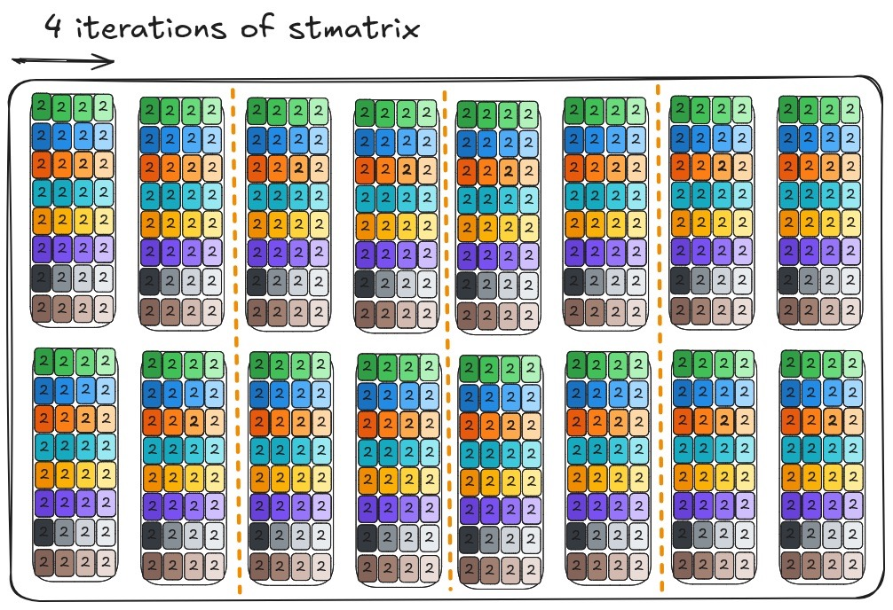
///caption
4 iterations of stmatrix
///

Note that this will hit bank conflict issue when loading into shared memory and
as a result we use 128B swizzling (`BN * 2B = 128B`) to avoid the conflicts.

### TMA store

With data swizzled and packed in shared memory, we can launch the TMA store
operation to copy the data back to global memory asynchronously. The code below
shows how the TMA store and how it handles the synchronization. Before the TMA
issues the asynchronous store, we to fence the memory via
`fence_async_view_proxy` to ensure previous packing in shared memory is visible
to TMA store.

```mojo
# Launch one TMA store per thread
if elect_one_warp and thread_idx.x < BN // TMA_BN:
  # memory fence to ensure previous shared memory access 
  # is seen by TMA instruction 
    fence_async_view_proxy()
    c_tma_tile = ...  # setup the tile for tma
    # c_tma_op is created similarly like a_tma_op for loading data
    c_tma_op.async_store(
        c_tma_tile,
        (block_idx.x * BN + thread_idx.x * TMA_BN, block_idx.y * BM),
    )
    # Commit TMA store
    c_tma_op.commit_group()
    # wait for the store to complete
    c_tma_op.wait_group[0]() 
```

After issuing the TMA store, we first commit the stores using `commit_group()`
. This groups the issued stores from the last commit up to that program
counter. The following `wait_group[N]()` waits util only `N` groups of stores
are still in flight. For instance, if there are 3 committed groups,
`wait_group[2]()` ensures the first group is completed and the last two groups
are in flight. In the above code, `wait_group[2]()` guards all TMA stores to
finish. The ability to wait by commit groups allows to you to build pipelines
and overlap other tasks efficiently in later optimizations.

There is another difference between the TMA store and the TMA load, since
multiple threads can issue the TMA stores in parallel.

```mojo
# Launch one TMA store per thread
if elect_one_warp and thread_idx.x < BN // TMA_BN:
```

Here `TMA_BN` is based on the swizzling mode (e.g. `TMA_BN=64` for 128B
swizzling and BF16). If the tile dimension `BN` is greater, then we need to
divide the dimension by `TMA_BN` and launch multiple TMA stores. For instance
`BN=128` maps to two stores as shown below, which are launched by two threads
to maximize parallelism.

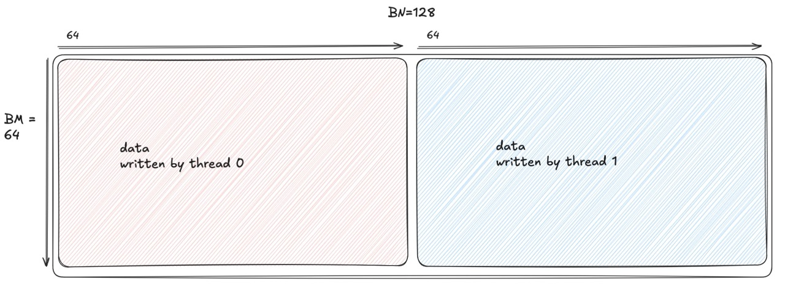
///caption
Mapping two TMA stores with two threads to maximize parallelism
///

### Performance

This kernel stays around the same at 293.6 TFLOPs, 0.7% slower to be exact.
Why? Well, the performance is still fundamentally bound by global memory
accesses.

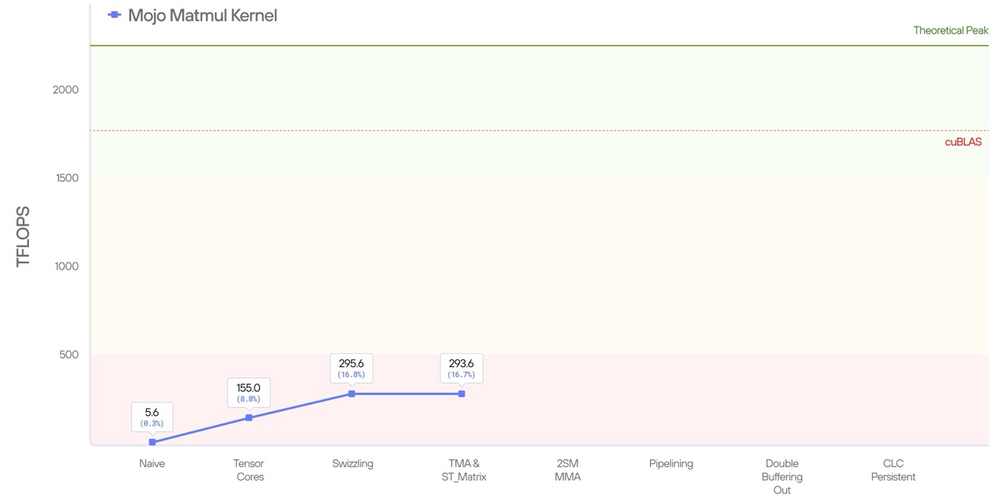
///caption
Performance after TMA and ST_Matrix optimizations
///

The following plot shows the compute and memory throughput from NCU. The green
bars are kernel 3 and the blue bars are kernel 4. As you can see, the compute
and memory throughput are very low for both kernels.


///caption
Compute and memory throughput profile from NCU
///

Furthermore, the true power of TMA store lies in its asynchrony, which enables
pipelining and overlapping operations. The current kernel sets the right ground
work for us to leverage these features in subsequent posts.

In conclusion, in this post we demonstrated how to tile matmul and how to
program a Blackwell GPU with the optimal instructions for performance using
features such as TMA load/store, `tcgen05.mma`, `stmaxtirx`, etc. This effort
results in a **58x** improvement over the naive kernel, but still behind the
performance of cuBLAS.

Future blog posts will build upon the kernel presented in this blog to improve
the underlying schedule and algorithm of execution. Specifically, the next post
will showcase how to build a warp specialized pipeline to overlap data transfer
and computation to get performance that’s closer to state-of-the-art.

## Appendix

### Descriptors

`tcgen05.mma` uses descriptors to specify the input data’s layout in shared
memory and instruction shape, data type, etc. To create an smem descriptors in
Mojo one does:

`adesc = MMASmemDescriptor.create[aSBO, aLBO, a_swizzle](a_smem_tile.ptr)`

The `MMASmemDescriptor` takes care of encoding all this information in the
format required by `tcgen05.mma`.The most important details are`LBO` and `SBO`:

- LBO (*leading dimension byte offset*): the number of bytes between two
  adjacent core matrices in K dimension.
- SBO (*stride dimension byte offset*): the number of bytes between two
  adjacent core matrices in the `M` / `N` dimension.

In kernel 2 i.e. without swizzling, printing this out for `A` shows:

```mojo
aSBO=128 
aLBO=1024
```

As shown below, `LBO` is 1024B because the distance between two columns  of
core matrices is `BM*16B = 1024B`. `SBO` is 128B the size of each core matrix
is `8x16B = 128B`.


The UMMA descriptor `idesc` follows a similar pattern, except it’s 32 bits and
encodes other information about the sparsity, data type, whether the matrices
are transposed or not, and other information. We refer the readers to our
[source
code](https://github.com/modular/modular/blob/386dba7051e1455b145ff2d33bcadfeb971ac7ed/mojo/stdlib/stdlib/gpu/mma_sm100.mojo#L737)
for the detailed encoding.

### Swizzling mathematics

The mathematical definition for swizzling is shown below. Given a swizzle
defined as  `Swizzle(bits, base, shift)`:

```mojo
## A generic Swizzle functor
# 0bxxxYYYxxxxZZZxxxx
#                ^--^  Base is the number of least-sig bits to keep constant
#      ^-^    ^-^      Bits is the number of bits in the mask
#        ^------^      Shift is the distance to shift the YYY mask
1) ZZZ is the first mask, extracted right after the base
2) YYY is the second mask, extracted shift after the base
3) We XOR these two, to get AAA=YYY XOR ZZZ
4) We place this new substring in place of the first mask, ZZZ
5) Final answer becomes:
# 0bxxxYYYxxxxAAAxxxx
```

If you look at the lower-level Mojo code, the swizzle is implemented as:

```mojo
bit_msk = (1 << bits) - 1
self.yyy_mask = bit_msk << (base + max(0, shift))
self.zzz_mask = bit_msk << (base - min(0, shift))
swizzled = offset ^ (offset & self.yyy_mask) >> shift
```

Consider the 128B swizzle where `bits=3`, `base=4`, and `shift=3`. The
mathematics indicates we extracts 7-9 bits of the input address as a mask and
`xor` the 4-6 bits with it, which generates the pattern shown in kernel 3:


///caption
Swizzling pattern for kernel 3
///
