- **Authors**: Ali Taha, Jiexiang Liu, Hengjie Wang, Abdul Dakkak
- **Date**: September 12, 2025

In the prior blog posts in this series ([Part
1](./matmul-on-blackwell-part-1.md) and [Part
2](./matmul-on-blackwell-part-2.md)) we talked about how to achieve ~300GFlops
for Matmul on NVIDIA’s Blackwell GPUs. In this post, we continue on this
    journey and discuss how to leverage the 2SM technique along with pipelining
    to **increase our performance about 5x and get within 85% of
    state-of-the-art (SOTA)**.

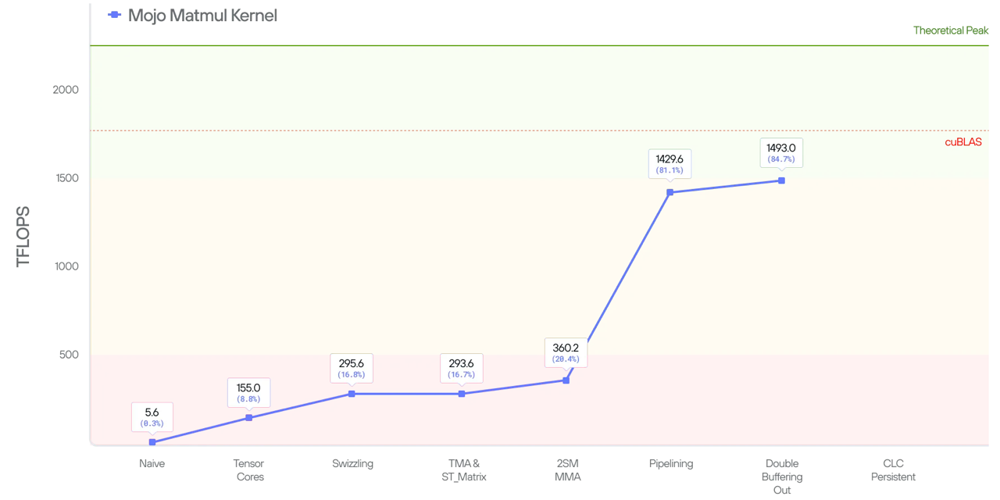
///caption
Figure 1: roadmap to 85% performance
///

## Kernel 5: multicast and 2xSM MMA

Since NVIDIA’s Hopper generation, Streaming Multiprocessors (SMs) can be
grouped and Cooperative Thread Arrays (CTAs) within the same SM group can
access each other’s shared memory (also known as distributed shared memory
access). This brings up two advanced optimizations on Blackwell:

- Tensor Memory Accelerator (TMA) multicasting—supported since Hopper:  SMs
  collaborate on loading a tile into shared memory.
- 2xSM Matrix Multiply-Accumulate (MMA): 2 SMs’ tensor cores collaborate on one
  large MMA operation using inputs in SMs’ shared memory.

Let’s examine both techniques and see how they are reflected in code. The first
thing we need to do is inform the code about the size of the cluster (the
`cluster_shape`). This can be done in Mojo using the `@__llvm_metadata`
decorator:

```mojo
@__llvm_metadata(`nvvm.cluster_dim`=cluster_shape)
fn blackwell_tma_pair_umma_kernel[
 a_type,
 ...other parameters...,
 cluster_shape
]
```

The above sets the “CTA cluster” launch shape for the kernel at compile time.
CTAs within in the same cluster can access to each others’ shared memory.

### CTA memory multicasting

To understand memory multicasting, let’s take a simple example, and examine
what we’d have to do without the multicasting feature. For visualization, we
will use A, B, and C as 256x256 matrices. In this case, we will launch 4 CTA’s.

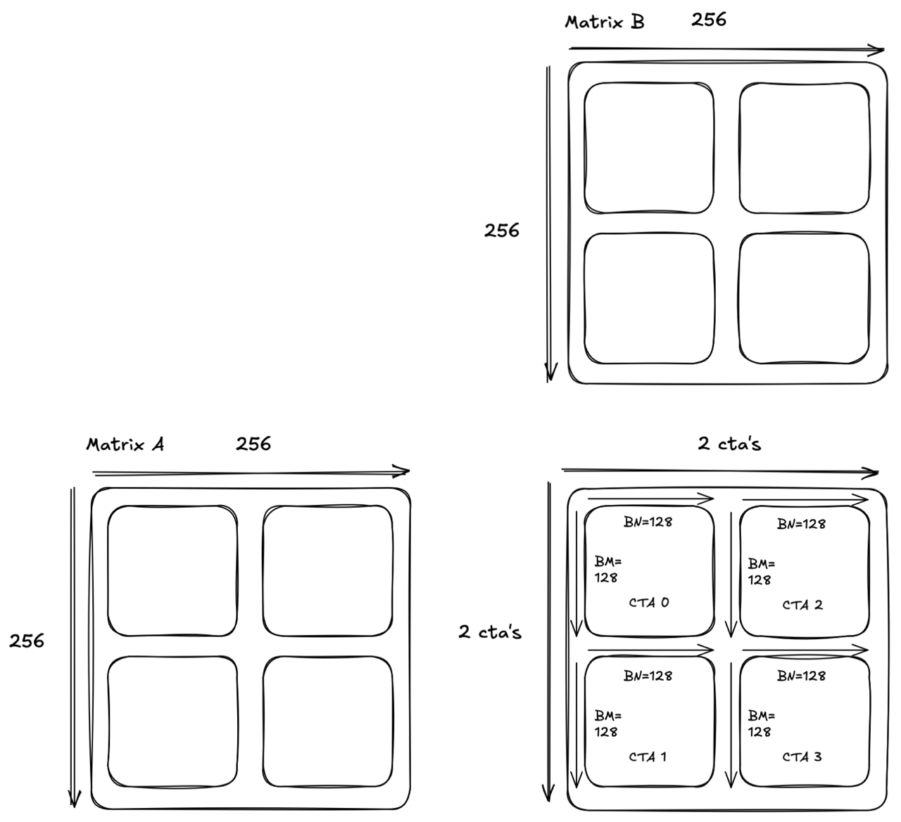
///caption
Figure 2: matrix multiplication of two 256x256 matrices with 4 CTAs
///

Each CTA will compute a `128x128` tile. Let’s examine which tiles each CTA
loads throughout `K/BK` :

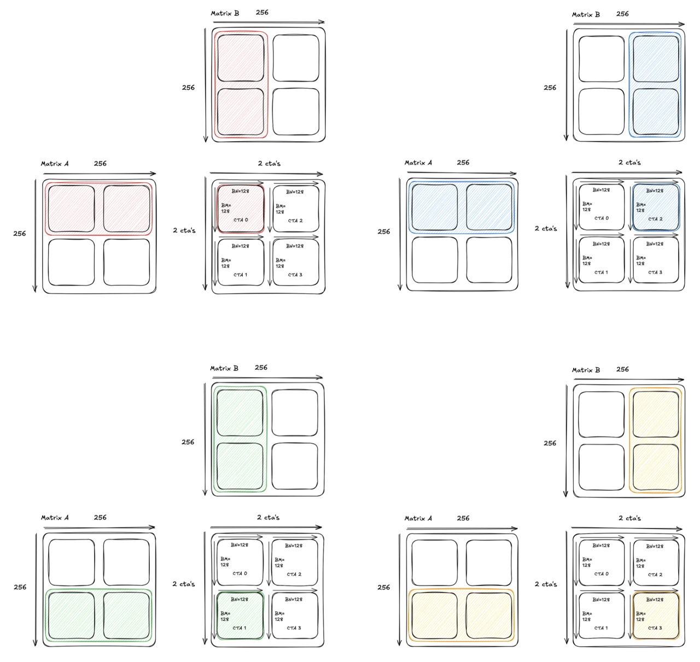
///caption
Figure 3: CTA tile loading
///

Note the redundancy in the memory loads. This is similar to the redundancy we
noticed at the beginning of the [blog
series](./matmul-on-blackwell-pt2.md),
but this time the redundancy is occurring at tile granularity instead of
element granularity.

How can we mitigate this? If we group these 4 CTAs into a 2x2 cluster, the SMs
can now access each others’ shared memory, which allows each SM to load a tile
from global memory and then broadcast the memory to its neighbors.

With this capability, we can adjust our load strategy and have the two CTA’s
along the same row load exactly one half of the tile from A, and to broadcast
that half to their neighbor. That way, both CTA’s do half the loads while still
getting the full tile. Visually, this looks like:

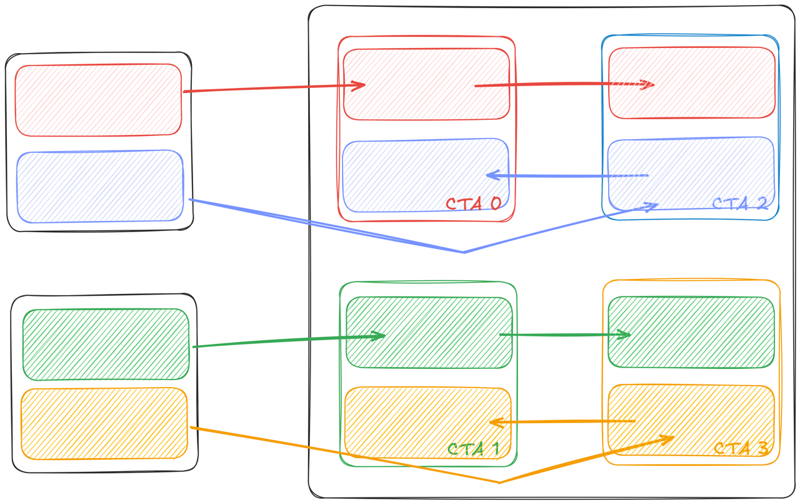
///caption
Figure 4: CTAs multicasting tile rows of A
///

We can extend this technique to save the loads for the B matrix as well:
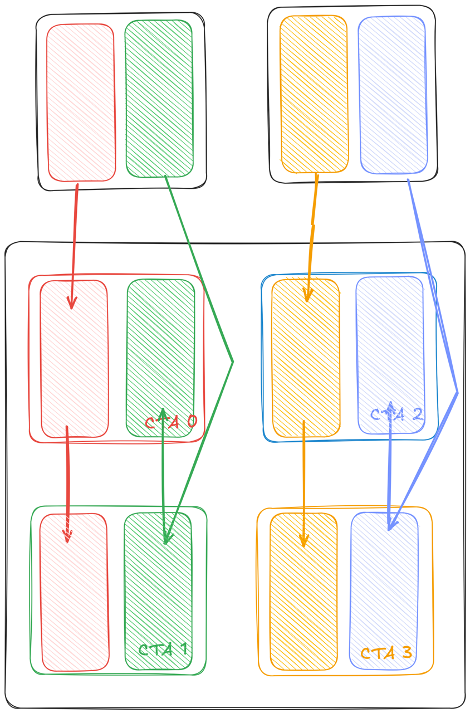
///caption
Figure 5: CTAs multicasting tile columns of B
///

This technique is called multicasting and is scalable. For example, when
launching a 4x4 cluster we’d make each CTA load a half of its tiles and get the
rest of the data from its peers. Let’s look at how this looks in Mojo code. We
begin by declaring the TMA ops on the host side:

```mojo
a_tma_op = create_tma_tile[
    (BM // cluster_shape[1], BK), swizzle_mode=a_swizzle
](ctx, a)

b_tma_op = create_tma_tile[
    (BN // cluster_shape[0], BK), swizzle_mode=b_swizzle
](ctx, b)
```

Since each CTA will slice the shared memory tiles for A and B and broadcast
them to corresponding peer CTAs, we divide the TMA tile by the cluster
dimension. In the GPU kernel, we launch the multicast load using:

```mojo

if elect_one_thread:
   ....
   a_tma_op.async_multicast_load(
       a_smem_slice,
       tma_mbar[0],
       (UInt(i * BK), UInt(a_gmem_slice_coord)),
       a_multicast_mask,
   )
```

The API is similar to the `async_load` TMA API we showed in [our last
blog](./matmul-on-blackwell-part-2.md)
but with a few key differences, discussed in the following paragraphs.

First, there is an additional TMA mask `a_multicast_mask`. The TMA mask is a 16
bit value describing the CTA index involved in the load. Each bit stands for
one CTA and there can be at most 16 CTAs in one cluster. For example, in the
above CTA 0 and 2 multicast the A tile so the CTA masks are both `0b101`. In
Mojo we can compute that via:

```mojo
var rank_m = block_id_in_cluster.x
# CLUSTER_M and CLUSTER_N are cluster dimensions
@parameter
for i in range(CLUSTER_N):
    a_multicast_mask |= 1 << (i * CLUSTER_M)
a_multicast_mask <<= rank_m
```

The layout tensor `a_smem_slice` is sliced from the original tile by offsetting
the base pointer:

```mojo
alias a_tma_load_size = a_desc_layout.size()
var rank_n = block_id_in_cluster.y
var a_smem_slice = __type_of(a_smem_tile)(
    a_smem_tile.ptr + rank_n * a_tma_load_size
)

```

We also update the corresponding coordinates in global memory for this tile
slice:

```mojo
# Number of rows per slice
alias a_tma_rows = a_desc_layout.shape[0].value()
a_gmem_slice_coord = block_idx.x * BM + Int(rank_n) * a_tma_rows
```

### 2xSM MMA

We have shown how distributed shared memory and multicast can help reduce the
data volume from global memory to shared memory. However there is still one
limitation—the tiles are still duplicated in the distributed shared memory.
Looking into CTAs 0 and 1 in the previous example, we see both CTAs keep a copy
of `BNxBK` tile in shared memory, as shown in the left figure below. Given each
CTA has access to the other’s shared memory, saving two copies of the same tile
is a waste of resources.

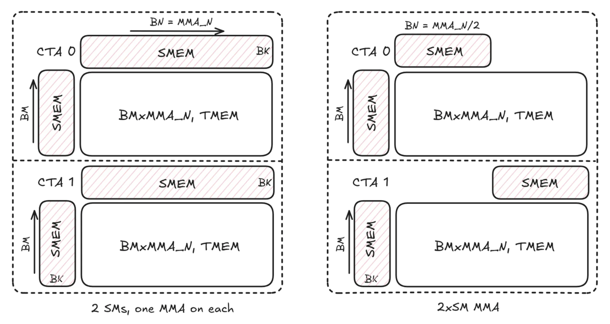
///caption
Figure 6: duplication of tiles in distributed shared memory
///

Blackwell’s 2xSM MMA instruction (`tcgen05.mma.cta_group::2`) is designed to
address this problem. As shown in right figure above, CTAs 0 and 1 works as a
pair and each only loads half of the B tile. The 2xSM MMA instruction sees both
halves in shared memory and coordinates the tensor cores on both SMs to
complete MMA operation as large as two single SM MMAs. Comparing the left and
right figures above, the 2 SMs are calculating the same MMA workload `2*BM x
MMA_N x BK` , where `MMA_N` denotes the N dimension of MMA shape, and producing
the same result, however the 2xSM instruction reduces the shared memory usage
for the B tile by half.

Comparing to multicast load with single SM MMA, 2xSM MMA reduces shared memory
traffic in two ways. First, CTAs 0 and 1 still load the same half of the B tile
as in multicast load (see Figure 5) but it’s only a regular TMA transfer, i.e.
the multicast step is omitted. Moreover, the traffic from shared memory to
tensor memory for the B tile is also halved as we only save one copy of it in
the distributed shared memory.

The code to launch 2xSM MMA is quite similar to launching single SM MMA ([see
our previous
blog](./matmul-on-blackwell-part-2.md)),
with the exception of using `elect_one_cta` . Since two SMs collaborate on one
MMA operation, only one CTA should launch the instruction and that’s the CTA
with even ID in each pair of CTAs. Hence, the `elect_one_cta` is a predicate to
select the launching CTA (also called the leader CTA).

```mojo
if elect_one_cta:
    # wait for data arriving in shared memory
    ...
    if elect_one_thread:

      @parameter
    for j in range(num_k_mmas):
        var c_scale = 0 if i == 0 and j == 0 else 1
        alias idx = IntTuple(0, MMA_K * j)
        alias a_offset = a_smem_layout(idx) * sizeof[a_type]()
        alias b_offset = b_smem_layout(idx) * sizeof[b_type]()

          mma[cta_group](
              adesc + a_offset,
              bdesc + b_offset,
              tmem_addr,
              idesc,
              c_scale=c_scale,
          )
          mma_arrive_multicast[cta_group](mma_mbar, c_mma_mask)

```

The `mma` function above will invoke the `tcgen05.mma.cta_group::2` instruction
when `cta_group` is 2. We also change the arrive function from `mma_arrive`
([last
blog](./matmul-on-blackwell-part2.md))
to `mma_arrive_multicast` , which takes `cta_group` and signals the leader
CTA’s memory barrier when `cta_group=2`.

#### Tensor memory layout

With 2xSM MMA instruction, the two CTAs partition the M dimension (`MMA_M`)
evenly (`BM = MMA_M/2` ) and each has half of the result of shape `BM x MMA_N`
in tensor memory. The instruction supports `MMA_M` values of 128 and 256. For
`MMA_M=256`, the TMEM layout for each half is the same as single SM MMA as
shown in Figure 7 below. The top half is stored in the leader CTA with the
lower half in its pair CTA. The output to global memory is the same as in
kernel 4 from our last post.

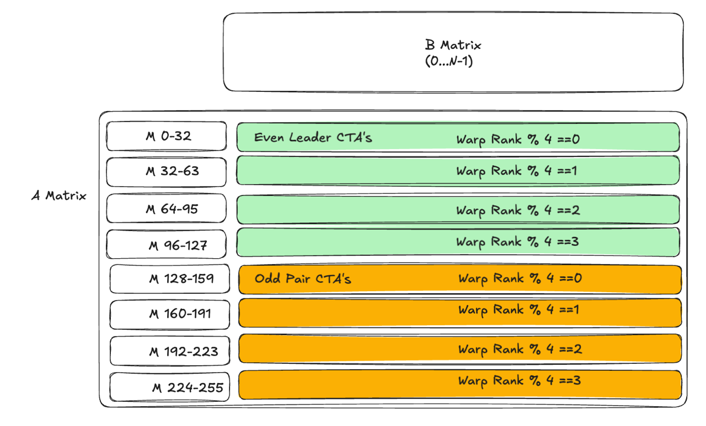
///caption
Figure 7: tensor memory layout
///

For `MMA_M = 128`, the layout is different than above. We skip the details here
and refer the reader to the code since `MMA_M = 128` is less important in
production.

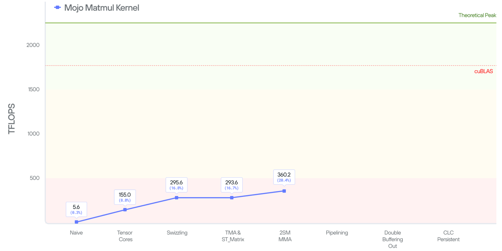
///caption
Figure 8: 20% SOTA performance with CTA memory multicast and 2xSM MMA
///

With this implementation, we are now at 360.2 TFLOPs and about 20% of our SOTA
goal. If we look at the profile, even though we are using the advanced MMA
instruction, we’re still limited by global memory’s throughput because the
computation still waits for data transfer to complete. Our next optimization is
going to remove this barrier and increase the overlap between computation and
memory transfer.

## Kernel 6: 2SM pipelining

To keep the code clean throughout the explanation of this kernel, we wrap up
the logic we use to load tiles into shared memory through a function call to
`load_AB()`, and we wrap up the logic for calling the MMA through a function
call `consume_AB()`. We further abstract the code to write it out with a
function call to `store_C`.

If we operate at this granularity, the previous kernel performs the following:

```mojo
for i range(K/BK):
 # Issue asynchronous TMA load
 load_AB()
 # Wait on barrier until they're loaded
 tma_mbar[0].wait(tma_phase)
 # Issue asynchronous MMA
 consume_AB()
 # Wait on barrier until they're consumed
 mma_mbar[0].wait(mma_phase)

store_C() # Write the results out
```

At any given moment, half of our hardware is idle. Either the tensor cores are
waiting for the data to arrive or the TMA is waiting for for MMA to finish so
that the shared memory buffer becomes available. The data dependence prevents a
CTA from leveraging both hardware units simultaneously.

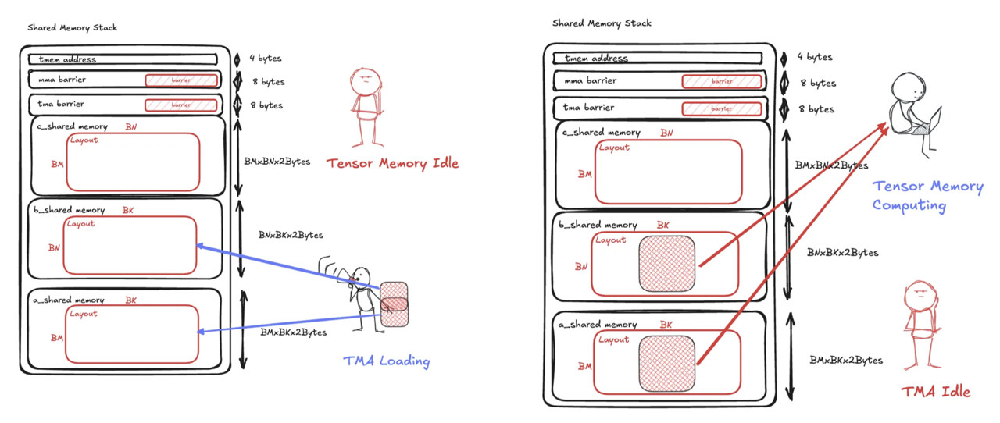
///caption
Figure 9: data dependent contention for CTAs
///

### Pipelining MMA and TMA

The classic algorithm to overcome idleness is to introduce multiple buffers in
shared memory and overlap MMA with TMA via pipelining. To exploit this, we need
to first check our shared memory usage.

On a Blackwell GPU, the kernel can access up to up to 227 KB shared memory
(shared memory and L1 cache combined provide one with 228 KB cache memory, but
1 KB has to be reserved for L1). So far we have the following usage with the
largest 2xSM MMA instruction of shape 256x256x16 for BF16:

- one A tile: `BM x BK x 2B = (MMA_M / 2) * 64 * 2B = 16 KB`
- one B tile: `BN x BK x 2B = (MMA_N / 2) * 64 * 2B = 16 KB`
- one C tile: `BM x MMA_N x 2B =  64 KB`

We have used less than half of the capacity. Leveraging the shared memory
capacity, we introduce 5 stages and organize them into a [circular
buffer](https://en.wikipedia.org/wiki/Circular_buffer).

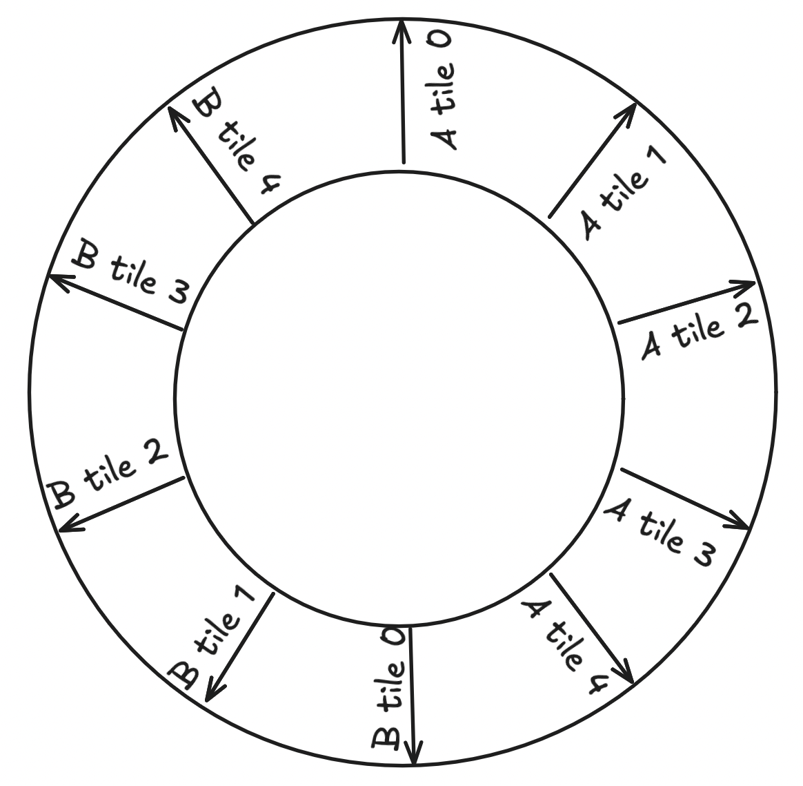
///caption
Figure 10: a 5 stage circular buffer
///

Then we let TMA and MMA iterate through the buffers in parallel such that when
MMA is consuming one buffer, another TMA can
[prefetch](https://en.wikipedia.org/wiki/Prefetching) data into another buffer
for subsequent computation. As a result, we can increase the overlap between
    computation and communication.

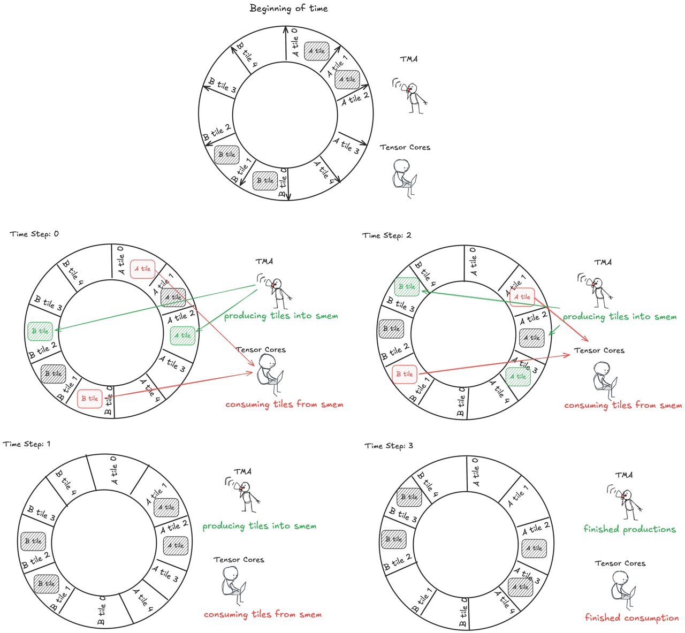
///caption
Figure 11: overlapping of communication with computation using a circular buffer
///

### Warp specialization

To implement this pipelined pattern, we need to touch on another important
concept—warp specialization. Thus far, we’ve been using 4 warps in previous
kernels due to the requirement of loading from TMEM, and TMA and MMA are both
launched using thread 0. To have TMA and MMA issued in parallel and operate on
different pipeline stages, we need to specialize different warps for each task.
This is called **warp specialization**. The high level code structure is as
follows:

```mojo
    if WarpRole.is_main_load():
        for i in range(num_iters):
            ...
      mma_mbar[stage].wait(phase)
      # issue TMA loads and singals tma_bar
      ...

    if WarpRole.is_mma():
        for i in range(num_iters):
      ...
            tma_mbar[stage].wait(phase)
            # Issue 2xSM MMA and signals mma_mbar
            ...
            mma_arrive_multicast[cta_group](mma_mbar, c_mma_mask)

```

We specialize one warp for issuing TMA and one for issuing MMA and they iterate
through the tiles concurrently. Additionally, we need the warps to inform each
other if a tile has arrived or has been consumed and the underlying buffer is
ready for new data. This communication is done via memory barriers. In the
above, we use the same memory barriers as in previous kernels, however the MMA
warp waits on the TMA barrier (signaled by the TMA warp) to query if the input
is ready for computation. Similarly, the warp specialized for TMA operations
waits on MMA barrier to know if buffer is ready for writing new data.

### Output

We still need four warps for using TMEM in the output. Following warp
specialization, we specialize four separate warps for output. In the next post,
this will be necessary to overlap output with TMA and MMA. We also need another
memory barrier to communicate between MMA and Output warps that the MMA results
are ready for output. The high level structure becomes something like:

```mojo
    if WarpRole.is_main_load():
        for i in range(num_iters):
            ...
      mma_mbar[stage].wait(phase)
      # issue TMA loads and singals tma_bar
      ...
    if WarpRole.is_mma():
        for i in range(num_iters):
      ...
            tma_mbar[stage].wait(phase)
            # Issue 2xSM MMA and signals mma_mbar
            ...
            mma_arrive_multicast[cta_group](mma_mbar, c_mma_mask)
        # Signal output warps
        if elect_one_sync():
            mma_arrive_multicast[cta_group](compute_barrier, mma_complete_mask)

    if WarpRole.is_epilogue():
        compute_barrier[].wait()
        # Store result to global memory
        ...
```

Here the MMA warp additionally signals a new memory barrier, `compute_barrier`.
Then the output warps waits on `compute_barrier` to ensure the result is ready.
The storing part is same as before.

Benchmarking this pipelining strategy increases our performance and puts us at
1429 TFLOPs, or 81% of SOTA.

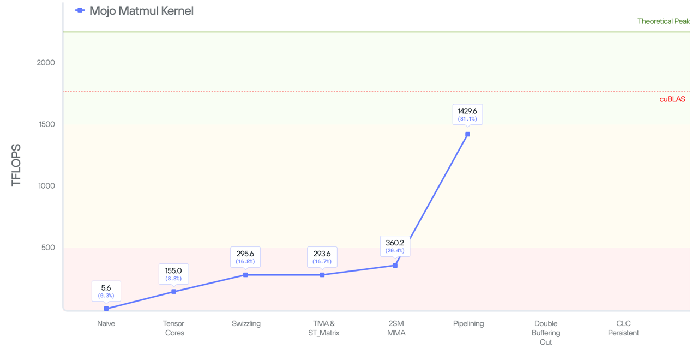
///caption
Figure 12: 81% of SOTA performance with 2SM pipelining and warp specialization
///

## Kernel 7: double-buffering the write-out

Thus far we have been optimizing the loading of the data into the matmul, but
we can also optimize the storing of the data into the output. First, let’s
briefly review how we store the result in TMEM to global memory.

```mojo
def store_c():
 # move all of tensor memory into registers
 registers = tcgen05_ld[
    parameters
 ](tmem_address)
 # move all of registers into shared memory
 for block_offset in range(BN/TMA_BN):
  for st_matrix_offset in range(TMA_BN//16):
      st_matrix[c_smem_tile, registers]
 # move the entire shared memory tile into global memory
 c_tma_op.async_store(
     c_tma_tile,
     ((block_idx.x * **MMA_N** + thread_idx.x * TMA_BN), (block_idx.y * BM)),
 )
```

There are three main steps when storing the C data: TMEM to registers,
registers to shared memory, and shared memory to global memory. These transfers
are executed sequentially due to the data dependence. However, that’s not
necessary especially when TMA store is asynchronous. Applying the same idea as
before, we can pipeline the TMA and MMA operations.

To do that, we declare two output tiles (called double-buffer) of shape `BM x
StageN` in shared memory and ping-pong between them. For simplicity, we start
with `stageN = 32` (this is a value that can be tuned). The double-buffer
pipeline strategy is illustrated below for two iterations. After `stmatrix`
stores the first output tile to shared memory, we issue the TMA store but don’t
block. Instead, we immediately begin loading from TMEM and writing the data
into shared memory using the other buffer. Using this scheduling strategy, the
TMA store overlaps with the TMEM ⇒ register ⇒ shared memory transfer for the
other tile.

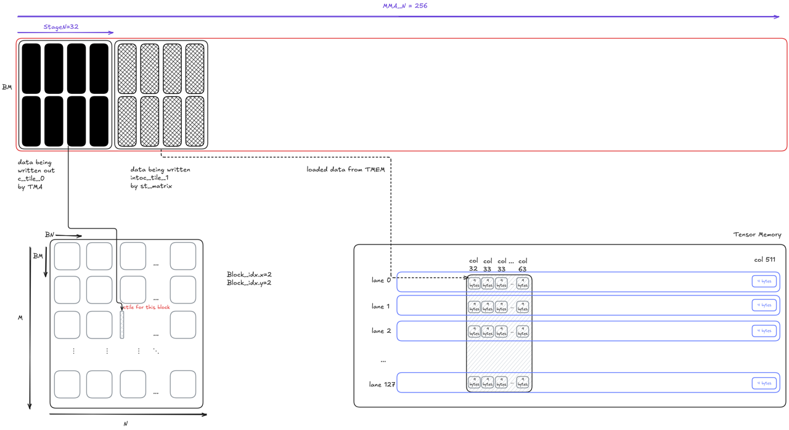
///caption
Figure 13: iteration 1 of the double-buffer pipeline
///

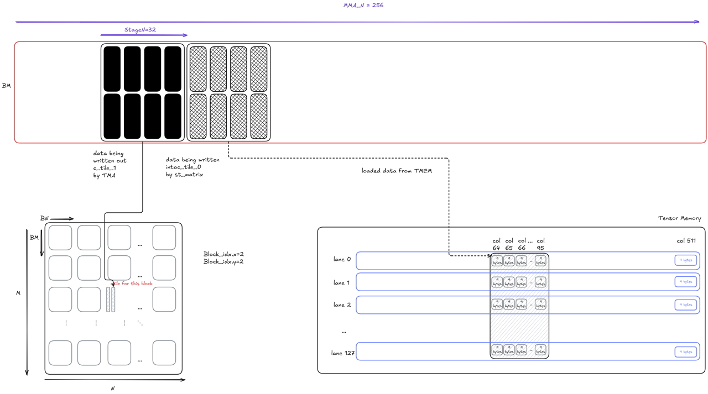
///caption
Figure 14: iteration 2 of the double-buffer pipeline
///

To implement the pipeline stategy in Mojo, we first break down the output into
`MMA_N / StageN = 8` iterations. At each iteration, we process `stageN = 32`
columns from TMEM. The TMEM load and `stmatrix` code is omitted for simplicity,
but the code is largely same as in previous kernels with the exception of
operating on smaller tiles.

```mojo
  # Process 32 columns at a time
    alias stageN = 32
    alias num_stages = MMA_N // stageN
    @parameter
    for stage in range(num_stages):
    # Load TMEM
    ...
    # Store to shared memory using stmatrix
    ...
        if elect_one_thread:
      # Issue TMA store
      ...
            c_tma_op.commit_group()

        @parameter
        # Keep one tma store in fly
        if stage < num_stages - 1:
            c_tma_op.wait_group[1]()
        # Last stage guard all tma store to finish
        else:
            c_tma_op.wait_group[0]()
```

The important part of the code is how we synchronize the TMA stores. Recall
that `commit_group` commits previous TMA stores as one group and
`wait_group[N]` waits until only the last N groups are still on-the-fly (the
last N+1, N+2, etc groups are finished). In the code above, the the first
iteration does not wait since it can proceed using the second buffer. The
second up to `num_stage - 1` iterations wait until there is only 1 TMA store
on-the-fly. This enables TMA store overlap with the TMEM load and `stmatrix` in
the next iteration. Finally, the last iteration of course waits for all TMA
stores to complete.

This pipeline execution comes with an additional (free) benefit. To explain, we
need to review our shared memory usage in kernel 5.

- 5 copies of A and B tiles for pipelining: `5 * (BM + BN) * BK * 2B = 160 KB`
- C tile for output: `BM * BN * 2B = 64 KB`
- Minor usage for memory barriers, tensor memory address.

The shared memory usage for output takes ~40%. But the kernel now use `2 * BM *
StageN * 2B = 16 KB` , we can use the saved 48 KB to increase the pipeline
depth for more overlap between TMA and MMA.

This optimization gives an additional 64 TFlops speedup and the kernel now
reaches 85% of SOTA.


///caption
Figure 15: 85% of SOTA performance with double-buffering the write-out
///

## Next steps

So, how do we get the last 15%? While we have overlaps loading from global
memory via overlapping the TMA load and MMA, the overhead of storing to global
memory is still outstanding (even though we performed some optimization in
kernel 7). We further suffer from the launch overhead between subsequent CTAs
dispatches. Pictorially, the overhead is:


///caption
Figure 16: overhead from CTA launches
///

In the next blog post, we will solve both limitations by introducing persistent
kernel using another advanced Blackwell feature—cluster launch control (CLC),
and demonstrate how we can close the gap to achieve SOTA.
