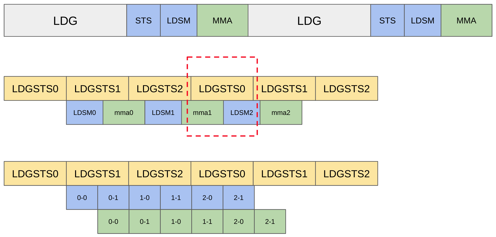
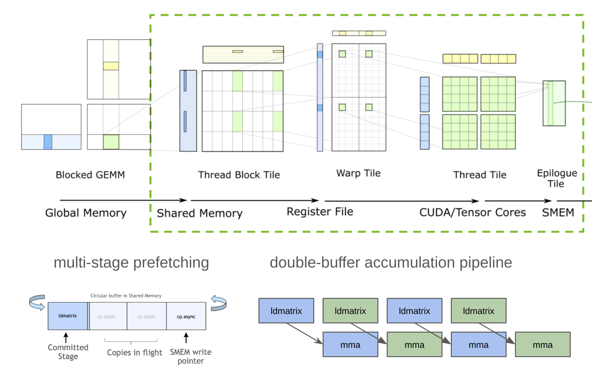
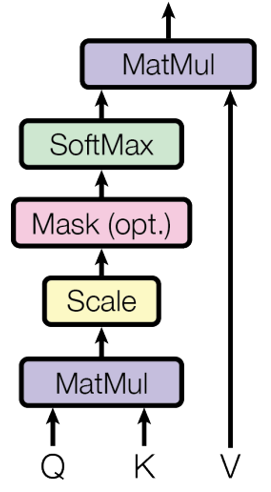
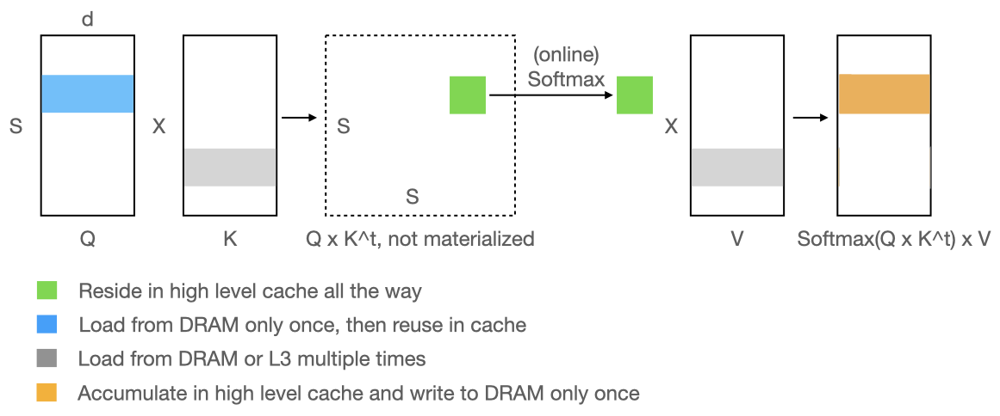

- **Author:** Hengjie Wang
- **Date:** August 6, 2024

In this article, we describe how the implementation of Flash Attention can be
understood within the context of fast matrix multiplication for Ampere
hardware. By taking advantage of new asynchronous data transfer instructions,
data transfer overhead can be hidden by the computation within a single thread
block through pipelined execution. Compared to matrix multiplication,
Flash Attention addresses the global data dependence incurred by `softmax` via
tiling and running statistics.

## How to write a fast `matmul` on Ampere

We begin with a discussion about how to write a fast `matmul` kernel on Ampere
hardware, drawing from the very good overview, "[How to Optimize a CUDA Matmul
Kernel for cuBLAS-like Performance: a
Worklog](https://siboehm.com/articles/22/CUDA-MMM)," by [Simon
Boehm](https://siboehm.com/about/).

### Baseline Shared Memory Matmul

We begin with a baseline implementation of shared memory `matmul`. The outer
loop of the multiplication advances the address of the row-major matrix `A` and
the column-major matrix `B` by a tile size until the final matrix `C` is fully
calculated.


/// caption
Baseline implementation of shared memory `matmul`. Source [Boehm, Simon](https://siboehm.com/articles/22/CUDA-MMM).
///

Each thread block loads tiles from `A` and `B` into shared memory and
multiplies the sub-matrices.

```mojo
var a_smem_tile = LayoutTensor[..., AddressSpace.SHARED].stack_allocation()
var b_smem_tile = LayoutTensor[..., AddressSpace.SHARED].stack_allocation()

var accum = Scalar[DType.bfloat16](0.0)

alias tile_size = 32 # as in figure
for k in range(0, K, tile_size):
  # Load from global memory to shared memory
  a_smem_tile.copy(...)
  b_smem_tile.copy(...)

  # Guard writing to shared memory.
  barrier()

  @parameter
  for kk in range(tile_size):
    accum += a_smem_tile[i, kk] * b_smem_tile[kk, j]

  # Guard read of shared memory.
  barrier()
```

### Why is it slow?

This baseline implementation has two key blockers to performance improvements.

- We are not using tensor cores.
- ***The barrier prevents us from overlapping data transfer and
  computation***.


/// caption
Strict serial ordering of load, store, and accumulation operations.
///

We added tensor core matrix multiply-accumulate (mma). As a consequence of the
barrier synchronization, four sets of instructions have to be executed in
strict serial order for each thread block.

1. **LDG**: load from global memory to registers
2. **STS**: store registers to share memory
3. **LDSM**: load from shared memory to register for tensor core accumulation.
4. **MMA**: tensor core accumulation using register values.

***Each thread block wastes computation resource while transferring data,
and vice versa.***

## Overlap computation and global memory access

To address these performance issues, the Nvidia Ampere architecture introduced
new asynchronous data transfer instruction, LDGSTS.

- The synchronous load from global memory to shared memory has two
  ***implicit*** steps:
  - `LDG,     registers,    [global_memory_address]`
  - `STS,     [shared_memory_address],    registers`
- In comparison, asynchronous transfer is ***one*** instruction and ***does
  not*** use registers.
  - `LDGSTS    [shared_memory_address],    [global_memory_address]`

This design relieves register pressure and allows for better overlap with
computation.

### How do we overlap?

The key insights are to:

- Maintain multiple buffers to resolve the RAW, WAR data dependence.
- Pipeline computation and data transfer.

```mojo
# Use circular buffer to maintain `num_pipeline_stages` buffers in
# shared memory for A and B.
var a_smem_iter = LayoutTensorIter[..., AddressSpace.SHARED, circular](...)
var b_smem_iter = LayoutTensorIter[..., AddressSpace.SHARED, circular](...)

for i in range(num_pipeline_stages - 1):
  (a_smem_iter + i).async_copy(...)
  (b_smem_iter + i).async_copy(...)

wait_for_async_copy()
barrier()

for k in range(0, K, tile_size):

  # LDSM: load registers from shared memory
  # MMA: tensor core accumulation using registers
  LDSM_and_MMA(a_smem_iter, b_smem_iter, ...)

  # Guard read of shared memory.
  (a_smem_iter + num_pipeline_stages - 1).async_copy(...)
  (b_smem_iter + num_pipeline_stages - 1).async_copy(...)

  wait_for_async_copy()
  barrier()
```

Example of 3 pipeline stages:


/// caption
Pre-fetching data concurrently with accumulation operation.
///

## Overlap computation and shared memory access

Similar to overlap global memory access, we pipeline LDSM and MMA. Two stages
are typically good enough in practice.

2-stages pipeline (double-buffer) for shared memory transfer and computation.

3-stages pipeline for global memory transfer and computation.


/// caption
Pipelines for global and shared memory transfer and computation.
///

Note how within both 2-stage and 3-stage pipelines, the global memory transfer
to shared memory (`LDGSTS`) for future computation happens concurrently with
the loading from shared memory (`LDSM`) and accumulation (`MMA`) operations.
The following figure illustrates the pipeline execution with matrix tiling and
architecture hierarchy.


///caption
Matrix view of fast multiplication. Source [cutlass](https://github.com/NVIDIA/cutlass).
///

### Split-K

Recap: we partition M and N dimension to create sub-matrices for thread blocks.


/// caption
Recap - baseline implementation of shared memory `matmul`. Source [Boehm, Simon](https://siboehm.com/articles/22/CUDA-MMM).
///

What happens when M and N are small?  E.g. M = 64, N = 3072, K =  3072, and
tile_size = 128  ==>  24 thread blocks.  We are using < 25% SMs on A100 (108 in
total).

We need to partition the K dimension to create more tasks.

E.g. M = 64, N = 3072, K = 3072, split K into 2 partitions

```mojo
# Given NDBuffer A, B, C.
if ceildiv(M, BM) * ceildiv(N, BN) < 0.8 * num_SMs:

  # Each partition updates a separate copy of C.
  # E.g. 2 partitions need 2 buffers with the same shape of C.
  var work_space = ctx.create_buffer[...](num_K_partitions * C.size())

  # Matmul updates its corresponding partitions.

  # Write result of K 0:1536 to work_space [0:64, 0:N]
  # write result of K 1536:3072 to work_space [0: 64, N:2*N]
  ctx.enqueue_function(matmul(A, B, work_space, num_K_partitions))

  # Sum work_space: [0:64, 0:N] + [0: 64, N:2*N].
  ctx.enqueue_function(split_k_reduction(C, work_space, num_K_partitions))
```

## Flash Attention

With these optimizations in mind, we can now consider the implementation of
Flash Attention.

### Multi-Head Attention Block

We begin with a brief overview of multi-head attention:

[Multi-Head
Attention](https://www.notion.so/Multi-Head-Attention-bbc2d300937a495da40c18b6a2028d22?pvs=21)

`Q`, `K`, and `V` in our stack have shape `[B, S, H, D]`, where:

- `B`: batch size
- `S`: sequence/context length (`matmul dim`)
- `H`: number of heads (similar to `B`)
- `D`: depth (`matmul dim`)

```mojo
# Per matmul, Q, K have shape [S, D]
batch_matmul(P, Q, K, transpose=True)
P = P * scale + mask
P = softmax(P)
# Per matmul, P: [S, S], V: [S, D]
batch_matmul(output, P, V)
```

{width="300"}
/// caption
Multi-head attention block
///

For example, with Replit-3B, assuming an input sequence `length = 1000`.

- context encoding,
  - `Q: [B, 1000, 24, 128]`,
  - `K` and `V: [B, 1000, 8, 128]`,
  - `P: [B, 24, 1000, 1000]`
- i-th token generation,
  - `Q: [B, 1, 24, 128]`,
  - `K` and `V: [B, 1000 + i, 8, 128]`,
  - `P: [B, 24, 1, 1000+i]`

*Note: sequence length (for Q) and context length for (K, V) are two separate
dims.*

The above materializes a S x S intermediate matrix (for context
encoding), which introduces huge memory usage and traffic for long
sequences.

### Flash Attention Algorithm

Flash Attention is an algorithm that optimizes the computation of multi-head
attention by addressing the memory bottleneck that occurs when computing the
attention matrix `P` (of size `S×S` for context encoding, where `S` is sequence
length). Instead of materializing the entire attention matrix in memory at once,
Flash Attention uses a tiling approach where it processes small chunks of queries,
keys, and values sequentially, computing attention scores and applying `softmax`
in an "online" manner within each tile.

The key innovation is the online softmax technique that maintains running
statistics (row maximum and row sum) across tiles, allowing it to compute
numerically stable `softmax` without needing the entire row of attention
scores. This approach delivers significant performance gains by dramatically
reducing memory usage and memory traffic—eliminating the need to store the
large `S×S` intermediate matrix that grows quadratically with sequence
length—while maintaining mathematical equivalence to the standard attention
computation.


/// caption
Flash attention
///
One of the primary challenges for implementing flash attention is how to
compute a numerically stable softmax for a small tile.

```mojo
# Prepared q_tile, p_tile, output_tile

for kv_offset in range(0, num_keys, kv_tile_size):
    # 1st matmul, skip scaling and masking
    k_tile = LayoutTensor[...](...)
    mma(p_tile, q_tile, k_tile, transpose_b = True)

    # ????????????? How to apply softmax to a p_tile ?????????????????
    # softmax(x): y[i] = exp(x[i]) / sum(exp(x[i]))
    # Prone to overflow and underflow.

    # To avoid overflow
    #   y[i] = exp(x[i] - max(x)) / sum(exp(x[i] - max(x))

    # fn softmax(x):
    #   var x_max       = rowmax(x)            # Need the entire row !!!!
    #   var numerator   = exp(x - x_max)
    #   var denominator = rowsum(numerator)    # Need the entire row !!!!
    #   return numerator / denominator
    #
    # ?????????????????????????????????????????????????????????????????

    # 2nd matmul
    v_tile = LayoutTensor[...](...)
    mma(output_tile, p_tile, v_tile)
```

### Online Softmax: break down softmax and blend it with matmul

To address this challenge, for each tile of keys/values, Flash Attention
computes attention scores `Q×K'`, then applies "online softmax" - a technique
that maintains running statistics (`rowmax`, `rowsum`) to compute numerically
stable `softmax` across tiles without needing the full attention matrix.

The key insight is that when a new tile produces a larger maximum value, it
corrects both the running sum and the previous output using an exponential
correction factor, ensuring the final result is mathematically equivalent to
computing softmax over the entire sequence at once. This allows attention to be
computed with constant memory usage regardless of sequence length.

```mojo
# Prepared q_tile, p_tile, output_tile

var rowmax, rowsum = -inf, 0.0

for kv_offset in range(0, num_keys, kv_tile_size):
    # 1st matmul, skip scaling and masking
    k_tile = LayoutTensor[...](...)
    mma(p_tile, q_tile, k_tile, transpose_b = True)

    # ===================== Online softmax ======================
    # Find current tile's rowmax and update the record
    current_max = max(rowmax, row_reduce_max(p_tile))
    correction  = exp(rowmax - current_max)
    rowmax      = current_max
    # Softmax numerator for current tile
    p_tile      = exp(p_tile - rowmax)
    # Correct previous sum
    rowsum      = rowsum * correction + row_reduce_sum(p_tile)
    # Correct previous 2nd matmul output
    output_tile = output_tile * correction

    # 2nd matmul
    v_tile = LayoutTensor[...](...)
    mma(output_tile, p_tile, v_tile)

  # apply softmax's denominator
  output_tile /= row_sum
```

Creating task for thread blocks:

- Batch and Head dims are independent. (Recap `Q: [B, S, H, D]`)
- Partition sequence length i.e. each thread block updates a `Q` tile.

What about token generation i.e. sequence length = 1?

E.g. `sequence_length = 1`, `batch_size = 1`, `num_heads = 24`  -> 24 thread
blocks.  We are using < 25% SMs on A100 (108 in total).

The above is mitigated by `batch_size > 1`. Yet, we’re faced with vector matrix
multiplication than matmul, which calls out for additional optimizations.

### Flash Decoding for Token generation

- Use more optimized vector matrix multiplication and flat matmul (out-of-scope).
- Split-K

PyTorch has a super nice animation for [flash decoding](https://pytorch.org/blog/flash-decoding/):


/// caption
Flash decoding. Source [PyTorch](https://pytorch.org/blog/flash-decoding/).
///

### Flash Attention 3

Hopper GPU introduces asynchronous warp group mma instructions (wgmma). In
addition to overlapping computation and data transfer, FA3 further pipelines
`wgmma` and `softmax` to overlap ***tensor core*** and ***cuda core*** computation.


/// caption
Flash attention 3
///
