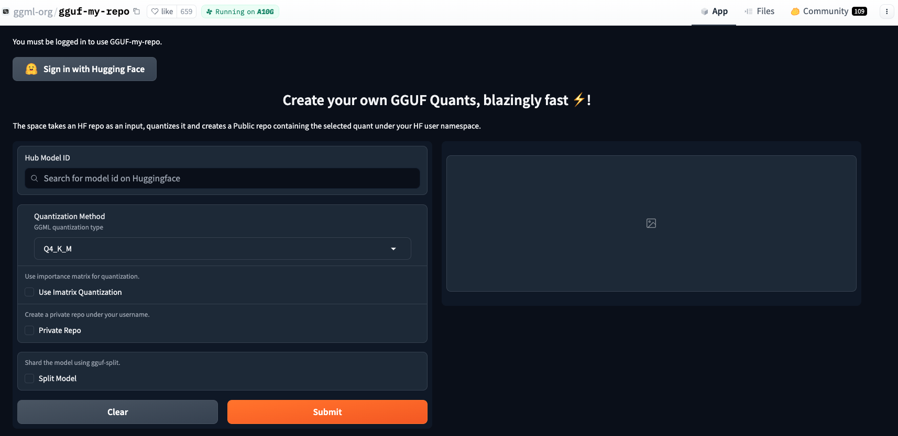

import Tabs from '@theme/Tabs';
import TabItem from '@theme/TabItem';
import MDXListing from '@site/src/components/Listing/MDXListing';

In this tutorial, you'll integrate a fine-tuned custom model into MAX
pipelines. More specifically, we will start with the initial configuration and
then demonstrate how to download a model from the Hugging Face Hub. If the
model is not already available in a supported quantized GGUF format, we'll show
you how to convert it to prepare for ingestion into the MAX pipelines. Finally,
we will explore how to use the quantized GGUF model via the MAX pipelines CLI.

## About model customization

Model customization in machine learning typically involves modifying a pre-trained model to better suit specific tasks or datasets.
One effective approach is fine-tuning, where a model trained on a large dataset is further trained (or fine-tuned) on a smaller,
task-specific dataset. In this tutorial, we focus on [Low Rank Adaptation (LoRA)](https://arxiv.org/abs/2106.09685).

LoRA (and its quantized variant [QLoRA](https://arxiv.org/abs/2305.14314))
allows for efficient adaptation of large models by only updating a small set of
additional parameters, preserving the original model's structure by integrating
LoRA layers without altering the primary architecture. For this tutorial, we
are assuming the LoRA weights have been merged into the original model such as
**Llama3.1**. If you want to serve a LoRA adapter with MAX without merging the
weights into your base model, see the [LoRA adapters](/max/serve/lora-adapters)
guide.

Such a functionality is provided by major fine-tuning libraries such as
[unsloth `save_pretrained_merged`](https://docs.unsloth.ai/basics/saving-models/saving-to-gguf)
or using [PEFT model merging](https://huggingface.co/docs/peft/en/developer_guides/model_merging) APIs.

## Step 1: Set up Hugging Face access

To interact with models hosted on Hugging Face, secure access is required either via SSH or an access token.
Follow the instructions in the [Hugging Face documentation](https://huggingface.co/docs/hub/en/security-git-ssh) to set up SSH.
We can verify our configuration by running:

```sh
ssh -T git@hf.co
```

A successful setup will display `Hi <USERNAME>, welcome to Hugging Face`.

## Step 2: Set up MAX pipelines

Next is to clone the [MAX GitHub repository](https://github.com/modular/modular) and navigate to the MAX pipeline:

```sh
git clone -b stable https://github.com/modular/modular && cd max

cd src/max
```

## Step 3: Include the `huggingface_hub` CLI

We'll use the `pixi` CLI to create a virtual environment and install the
required packages. If you don't have `pixi`, you can install it with this
command:

```sh
curl -fsSL https://pixi.sh/install.sh | sh
```

Now install the `huggingface_hub` library to enable interactions with the
Hugging Face Hub. This package facilitates the download, and management of
models and datasets:

```sh
pixi add --pypi huggingface_hub hf_transfer
```

With the Hugging Face Hub CLI installed, we can proceed to the next steps of downloading and converting our model.

## Step 3: Convert to GGUF format

If your model is already in the [GGUF format](https://github.com/ggerganov/ggml/blob/master/docs/gguf.md), you can skip this conversion step and proceed directly to the next step.
If not, here are the most common methods to convert a model to a quantized GGUF format suitable for deployment:

- **Automated conversion via Hugging Face space**: We can use the [gguf-my-repo](https://huggingface.co/spaces/ggml-org/gguf-my-repo) space
  for a streamlined conversion process to convert to a supported quantized GGUF format. Remember to log in and for the sake of this tutorial,
  we choose the `Q4_K_M` quantization method.

  You can see all the supported quantization encodings in the [`QuantizationEncoding` module](/max/api/python/graph/quantization#max.graph.quantization.QuantizationEncoding).
  For demonstration, we will choose [mlabonne/FineLlama-3.1-8B](https://huggingface.co/mlabonne/FineLlama-3.1-8B).

  After conversion, the model will be available under your HugginFace USERNAME, ready for download and deployment.

  

  The following will download the converted GGUF model:

  ```sh
  pixi run huggingface-cli download \
  <USERNAME>/FineLlama-3.1-8B-Q4_K_M-GGUF \
  --repo-type model \
  --local-dir ./models
  ```

- **Manually convert via llama.cpp script**: Alternatively, utilize the [llama.cpp converter script](https://github.com/ggerganov/llama.cpp/blob/master/convert_hf_to_gguf.py) to manually convert your model.

  ```sh
  git clone https://github.com/ggerganov/llama.cpp

  # If your model is available in Hugging Face <REPO-ID/MODEL-ID>.
  # Ensure you replace <REPO-ID/MODEL-ID> with the appropriate
  # repository or model ID from Hugging Face.
  # Otherwise skip this command.
  pixi run huggingface-cli download <REPO-ID/MODEL-ID> \
   --repo-type model \
   --local-dir ./models

  python llama.cpp/convert_hf_to_gguf.py models
  ```

With all the requirements in place we are now ready to use our custom model in MAX pipelines.

## Step 4: Run the custom model

With our fine-tuned Llama 3.1 model successfully converted to GGUF format, we're
ready to put it into action using MAX pipelines. For this demonstration, we'll be
using our converted model file `finellama-3.1-8b-q4_k_m.gguf`.

First, let's install the necessary CLI tool. MAX provides the `max`
package, which we can easily install using the `pixi` command:

```bash
pixi global install modular -c https://conda.modular.com/max-nightly -c conda-forge
```

Before running our model, it's worth noting that MAX pipelines offer various
configuration options. You can explore these by running, `max --help`
for the available options.

:::note

If you use private or gated models, you must set your [Hugging Face access
token](https://huggingface.co/docs/hub/en/security-tokens) first. For example:

```bash
export HF_TOKEN="hf_..."
```

Then you can run a `max` command to execute a private or gated model.

:::

Now, let's run our custom model. We'll use the `max generate` command,
specifying our model configuration and a test prompt:

```bash
max generate \
  --model modularai/Llama-3.1-8B-Instruct-GGUF \
  --quantization-encoding "q4_k" \
  --weight-path "./models/finellama-3.1-8b-q4_k_m.gguf" \
  --prompt "What is the meaning of life?"
```

It generates the following answer:

```output
The meaning of life is a question that has been pondered by philosophers, scientists,
and spiritual leaders for centuries. It is a question that has no definitive answer,
as it is deeply personal and subjective to each individual. However, many have
attempted to provide their own interpretations or explanations.

One interpretation of the meaning of life is that it is simply to live and experience
the world around us. This view suggests that the purpose of life is to experience all
that it has to offer, whether it be through the senses, emotions, or intellectual
pursuits. In this sense, the meaning of life is not necessarily tied to any specific goal
or achievement, but rather to the process of living itself.

Another interpretation is that the meaning of life is to find purpose and meaning in
our lives. This view suggests that we are here to seek out our own unique purpose and
to strive to achieve it. This can be achieved through various means, such as through our
work, relationships, or personal pursuits.

A third interpretation is that the meaning of life is to connect with something larger
than ourselves. This view suggests that we are here to connect with a higher power,
whether it be through religion, spirituality, or a sense of awe and wonder at the
universe. In this sense, the meaning of life is to find a sense of purpose and
connection that transcends our individual lives.

Ultimately, the meaning of life is a question that each person must answer for themselves.
It is a question that requires us to reflect on our own values, beliefs, and experiences.
As the saying goes, "Ask a flower" - the meaning of life is not something that can be
answered in words, but rather in the experience of living itself.
```

For more information on quantization, see the [Quantization](/max/graph/quantize)
documentation.

## Next steps

Congratulations on successfully integrating your fine-tuned Llama3.1 model into the MAX pipelines! 🎉

We have navigated through setting up secure access, downloading and converting models, and finally running your custom model in MAX pipelines.
We encourage you to further customize your models via the MAX Graph API, test your pipeline and explore other MAX features including
how to **deploy your fine-tuned model on GPU using MAX Serve**.

Here are some other topics to explore next:

export const docs = [
  '../../develop/serve-custom-model-architectures.mdx',
  '../../develop/custom-ops.mdx',
  '../../graph/quantize.mdx',
];

<MDXListing mdxList={docs} />
